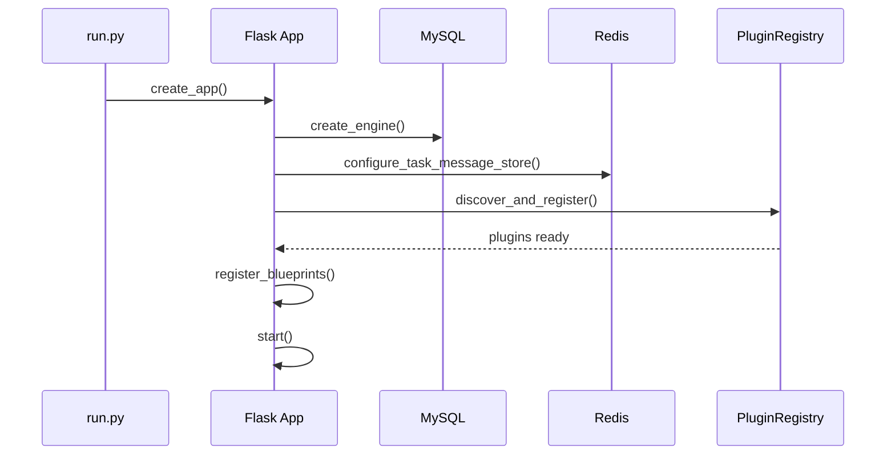

# 应用启动时序图

```mermaid
sequenceDiagram
    participant CLI as run.py
    participant Flask as Flask App
    participant DB as MySQL
    participant Redis as Redis
    participant Plugins as PluginRegistry
    CLI->>Flask: create_app()
    Flask->>DB: create_engine()
    Flask->>Redis: configure_task_message_store()
    Flask->>Plugins: discover_and_register()
    Plugins-->>Flask: plugins ready
    Flask->>Flask: register_blueprints()
    Flask->>Flask: start()
```
