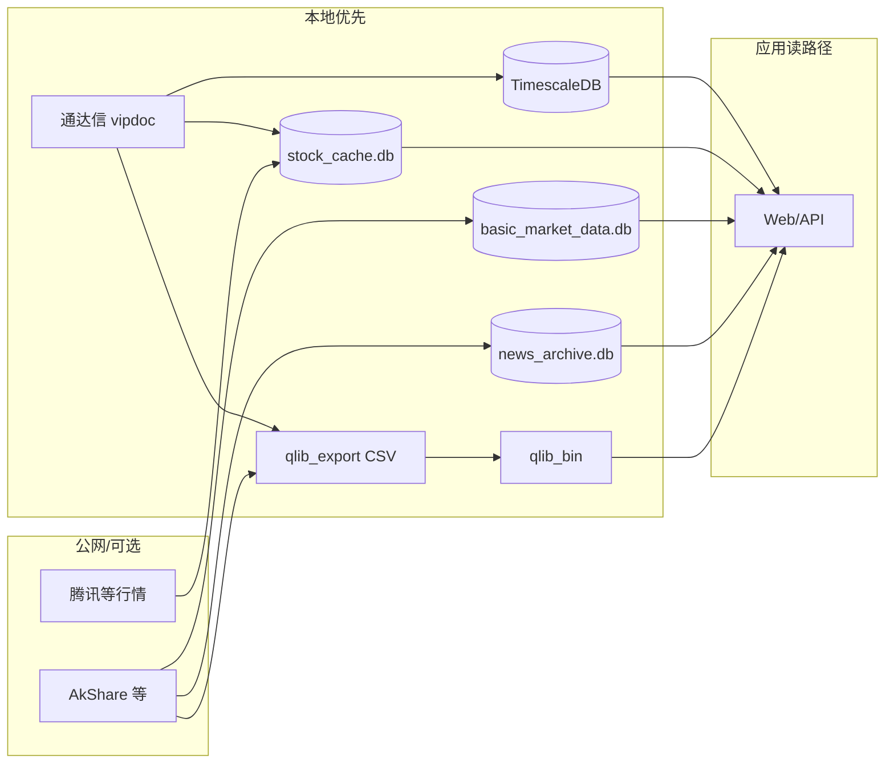

# 平台数据流与「本地优先」原则

本文梳理 **数据从哪来、落在哪、页面/API 读哪一层**，以及 **如何减少公网请求**：优先本机通达信与本地库，远程仅在「冷数据缺失、超过新鲜度阈值、或交易时段需要刷新」时触发。实现以当前代码为准（`app/bootstrap.py`、`MultiSourceMarketProvider`、`BasicMarketDataService`、`QlibPipelineService`、`StockNewsAccess`、Celery Beat）。

**历史 K 线写入 / 读取分步流程图（Mermaid）**：**[HISTORY_DATA_READ_WRITE_FLOW.md](HISTORY_DATA_READ_WRITE_FLOW.md)**。

---

## 1. 总原则

| 原则 | 说明 |
|------|------|
| **本地优先** | 能读 `TDX_ROOT_PATH`、`stock_cache.db`、`basic_market_data.db`、`news_archive.db`、`instance/qlib_export` / `qlib_bin` 的，不重复拉远程。 |
| **先全量、后增量** | 龙虎榜、财报快照、Qlib K 线等：首次部署用 **存量回填任务**（仅空库触发）做历史全量；日常用 **按交易日一次的定时任务** 做增量。**独立强制全量**（龙虎榜 ``backfill_longhu_full``、研报 ``backfill_yanbao_full``、新闻 ``backfill_news_archive_for_codes``）按需手动触发，默认不进 Beat。 |
| **K 线 / 生产入库（A 股）** | 推荐 **`TdxDaykSyncService` / `scheduled_cn_history_daily`**：通达信 lday → **TimescaleDB** + ``qlib_export`` CSV → ``qlib_bin``。MySQL 历史分表 / QuestDB / ClickHouse **入库已下线**。详见 [HISTORY_DATA_READ_WRITE_FLOW.md](HISTORY_DATA_READ_WRITE_FLOW.md)。 |
| **K 线 / 研究管线** | 夜间可选 **`qlib_incremental_pipeline`**：东财+TDX 合并 → CSV → bin；与上并行，注意勿重复覆盖同一标的。 |
| **历史 K 线 API 读顺序（A 股）** | **`HISTORY_PREFER_TIMESERIES=1`（默认）**：**①** Timescale → **②** 遗留 QuestDB/CH（若仍配置）→ **③** MySQL 分表 → **④** ``qlib_bin`` → **⑤** TDX lday → …。 |
| **通达信 TCP K 线写缓存与失败回退** | 开启 ``ALLOW_TDX_LIVE_HISTORY_READ`` 时，按 ``TDX_HISTORY_TCP_MAX_PAGES``（默认 6）× ``TDX_HISTORY_TCP_PAGE_SIZE``（默认 800，最大 800）分页调用 ``get_security_bars``，合并去重后 **一次性 ``save_stock_history``**。若连接/调用失败或返回空，则 **从 ``stock_history`` 按标的读最近 ``TDX_HISTORY_CACHE_FALLBACK_LIMIT``（默认 4000）根** 再与请求区间求交后返回（非 A 股路径同样适用）。 |
| **页面与 API** | 列表类（龙虎榜、研报、归档新闻）**默认查 SQLite**；行情全景/列表可走缓存库；个股详情在「缓存未过期」时减少 Provider 调用。 |
| **按频度调度** | **高**（盘中行情、核心池）：短周期（如 2 分钟级）；**中**（全市场轮询）：如 15 分钟；**低**（收盘后榜单、研报、日 K、财报同步）：**每个交易日 1 次**（固定钟点），避免与短周期任务叠网络峰值。 |

---

## 2. 分层数据路径（简图）

---

## 3. 分域说明

### 3.1 行情与日 K（多源 → Timescale / CSV / qlib → 页面）

- **写入（生产推荐）**：`TDX_DAYK_CELERY_BEAT=1` → **16:05** `scheduled_cn_history_daily`（Timescale + CSV + bin）；或 API `POST /api/v1/data/tdx-dayk/incremental-sync`。
- **写入（兼容）**：`MultiSourceMarketProvider` 等仍将行情写入 **`stock_cache.db`**；读路径命中远程源时可能回填 SQLite。
- **本地增强**：配置 **`TDX_ROOT_PATH`** 后，日 K 扫描 `vipdoc/*/lday`；研究侧见 Qlib ingest / `get_tdx_local_snapshot`。
- **读取**：A 股 K 线 API 以 **Timescale 优先**（见上表）；实时行情仍走腾讯等在线源与缓存。
- **Qlib 日 K（研究）**：`POST /api/v1/qlib/ingest` → CSV → bin；元数据 **`config/qlib_pipeline_meta.json`**。
- **定时**：**`TDX_DAYK_CELERY_BEAT`**（收盘主链）、**`QLIB_CELERY_BEAT=1`**（夜间 02:40 多源 ingest）、**`DATA_BACKFILL_BEAT`**（空库种子）。

### 3.2 龙虎榜、研报（远程 → SQLite → 页面）

- **落库**：`BasicMarketDataService` → **`instance/basic_market_data.db`**（龙虎榜表、研报表等）。
- **首次全量（仅空库）**：`backfill_longhu_if_empty`（仅库内无龙虎榜数据时分段拉历史）、财报侧 `backfill_financial_stash_if_empty`；需 **`DATA_BACKFILL_BEAT=1`** 在凌晨排队（见 `app/celery_app.py`）。
- **强制全量（独立任务）**：`app.tasks.data_backfill_tasks.backfill_longhu_full` → `BasicMarketDataService.run_longhu_full_historical_force`（不因已有龙虎榜跳过，仍按年窗分段 + `sleep` 礼貌爬取）；`backfill_yanbao_full` → `ingest_yanbao_eastmoney_html`，单分类行数默认取环境变量 **`YANBAO_FULL_MAX_ROWS`**（默认 500，上限 800）。二者 **默认不上 Beat**，由运维 `delay()` / CLI 触发。
- **日常增量（每交易日）**  
  - Celery：`scheduled_longhu` **17:05**、`scheduled_yanbao` **06:05**（上海时区）。  
  - 进程内线程：`BasicDataScheduler` 在 **17:00–17:20 / 06:00–06:30** 各跑一次，启动约 2 分钟后暖机补龙虎榜；**若同时启用 Celery Beat**，请设 **`ENABLE_BASIC_DATA_SCHEDULER=0`** 避免重复打源站。
- **页面/API**：`/longhu-bang`、`/yanbao-hub` 与 `GET /api/v1/market/longhu`、`/yanbao` **只读本地库**。
- **CLI**：`python -m app.cli longhu`、`yanbao`（见 [scripts_inventory.md](scripts_inventory.md) §4）。

### 3.3 个股新闻（远程快照 + SQLite 归档，读时本地优先）

- **逻辑**：`StockNewsAccess.fetch_bundled`（`app/services/data/stock_news_access.py`）  
  - 有归档库时：若未过期（默认 **24h**）则 **只读 `news_archive.db`**，不请求远程；过期或强制刷新才 `get_news_snapshot` 再 **ingest 回写归档**。  
  - 归档为空时拉一次远程并写入。
- **批量强制刷新（归档灌库）**：`app.tasks.news_backfill_tasks.backfill_news_archive_for_codes`（或模块内 `run_news_archive_force_refresh_for_codes`）对代码列表逐只 `fetch_bundled(..., force_refresh=True)`。代码优先级：任务参数 `codes` → **`NEWS_BACKFILL_CODES`**（逗号分隔）→ **自选股 SQLite** → 默认示例代码；并发与体量用 **`NEWS_BACKFILL_MAX_CODES`**（默认 200）、**`NEWS_BACKFILL_SLEEP_SEC`**（默认 0.45s）控制。可选 **`NEWS_ARCHIVE_BACKFILL_BEAT=1`**：Beat 每周日 **03:10** 跑一次（仍建议小池 + 限速）。

### 3.4 门户滚动 / 股道快讯（可选 JSON 落盘）

- **用途**：与 `AkshareNewsProvider` 合并进市场头条；CLI 可落盘到 **`instance/portal_news_dump/`**（`python -m app.cli portal-eastmoney` / `portal-10jqka`）。
- **原则**：**非页面主路径**；按需跑，避免与个股新闻归档混为高频任务。

### 3.5 财报快照（SQLite `cn_financial_stash`）

- **全量空库**：`backfill_financial_stash_if_empty`（`DATA_BACKFILL_BEAT`）。
- **日更**：`FINANCIAL_DAILY_BEAT=1` → 每日 **07:30** `scheduled_financial_stash_refresh`（标的来自 qlib meta 或 `FINANCIAL_DAILY_CODES`）。
- **读取**：基本面 API / Agent 工具走 Provider + 本地 stash，减少重复拉东财全表。

---

## 4. 定时任务与频度对照（现状 ↔ 建议）

| 数据/行为 | 当前默认（Celery / 线程） | 与「本地优先」关系 | 建议 |
|-----------|-------------------------|-------------------|------|
| 核心池行情 | Beat：**每 2 分钟**（`SCANNER_CELERY_BEAT=1`） | 写 `stock_cache`，减少页面直拉 | 交易时段保持；非交易日可关扫描 Beat |
| 全市场轮询 | Beat：**每 15 分钟** | 同上 | 与诉求「15 分钟级」一致 |
| 龙虎榜入库 | Beat **17:05** + 或线程调度 | 每日收盘后一次 | **每交易日 1 次**即可；勿与 2 分钟任务重复启两套路 |
| 研报入库 | Beat **06:05** + 或线程调度 | 每日一次 | 同上 |
| TDX 日 K 入库 | Beat **16:05**（`TDX_DAYK_CELERY_BEAT=1`） | 写 Timescale + CSV + bin | 每交易日 1 次；主链 |
| Qlib 增量 | Beat **02:40**（需 `QLIB_CELERY_BEAT=1`） | CSV→bin，夜间带宽友好 | 保持日级；全量仅回填 |
| 财报日更 | **07:30**（`FINANCIAL_DAILY_BEAT=1`） | 本地 stash | 每交易日 1 次 |
| 因子 IC 巡检 | **18:35**（可选） | 读本地 bin/结果 | 日级 |

**操作提示**：生产环境明确 **Celery vs 线程扫描器** 二选一（见 `ENABLE_CELERY`、`SCANNER_FORCE_THREADS`、`ENABLE_BASIC_DATA_SCHEDULER`），避免同一数据源双通道重复请求。

---

## 5. 环境变量速查（与数据流相关）

| 变量 | 作用 |
|------|------|
| `TDX_ROOT_PATH` | 启用通达信本地日线等，**减少 AkShare 依赖** |
| `TDX_DAYK_CELERY_BEAT` | `1` 收盘主链：TDX → Timescale + CSV → qlib_bin |
| `TDX_SYNC_ENABLE_TIMESCALE` / `TDX_SYNC_ENABLE_MYSQL` | 默认 `1` / `0`（不写 MySQL 历史分表） |
| `HISTORY_PREFER_TIMESERIES` | 默认 `1`：读路径 Timescale 优先 |
| `ENABLE_CELERY` / `CELERY_BROKER_URL` | 异步任务与 Beat |
| `SCANNER_CELERY_BEAT` | `0` 关闭 Beat 内 2min/15min 扫描 |
| `ENABLE_BASIC_DATA_SCHEDULER` | `0` 建议与 Celery 龙虎榜/研报并存时关闭 |
| `DATA_BACKFILL_BEAT` | `1` 启用空库全量回填（龙虎榜/财报/Qlib K） |
| `QLIB_CELERY_BEAT` | `1` 启用每日 Qlib 增量管线 |
| `FINANCIAL_DAILY_BEAT` | `1` 启用每日财报 stash 刷新 |

---

## 6. 待增强（与本文原则对齐的后续工作）

1. **新闻**：可选「批量标的、限速」的历史归档全量任务；与现有 24h TTL 策略并存时需统一配置项。  
2. **研报/龙虎榜**：监控 DB 体积与索引；超窗历史再分段回填时保持 `sleep_sec` 礼貌爬取。  
3. **CSV 为中间层**：文档化「研究/回测以 `qlib_export`+`qlib_bin` 为准、行情展示以 `stock_cache` 为准」的双轨，避免误以为单一表含全市场 K 线。  
4. **观测**：任务结果进消息中心（`task_message_store`），便于确认「日级只跑一次」是否生效。

---

## 7. 相关代码与文档

- `app/infrastructure/providers/market_data.py` — 行情与缓存  
- `app/application/services/basic_market_data_service.py` — 龙虎榜/研报/财报 stash  
- `app/services/data/stock_news_access.py` — 新闻归档与新鲜度  
- `app/application/services/qlib_pipeline_service.py` — CSV / meta / bin  
- `app/celery_app.py` — Beat 表  
- [QUANT_ATLAS_平台手册.md](QUANT_ATLAS_平台手册.md) — 部署与功能总览  
- [scripts_inventory.md](scripts_inventory.md) — CLI 与旧脚本关系  

---

*文档随版本迭代更新；调度以 `app/celery_app.py` 为准。*
