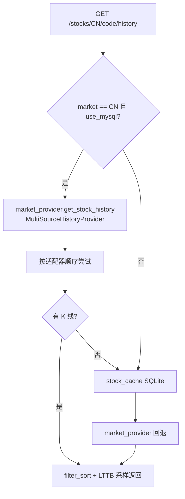

# 历史 K 线：写入与读取全流程图

本文描述 **A 股日 K** 的落盘（写）与 **GET /api/v1/stocks/CN/{code}/history**（读）链路。

**生产推荐主链路（2026-08-04）**：通达信 ipdoc/*/lday → **TimescaleDB** + qlib_export CSV → **qlib_bin**（Beat：TDX_DAYK_CELERY_BEAT / scheduled_cn_history_daily）。

MySQL 历史分表、QuestDB、ClickHouse **入库已下线**（Celery 不再写入；读适配器可保留）。

---

## 1. 总览：写与读两条主线

`mermaid
flowchart TB
  subgraph write_cn [A 股写入主线（推荐）]
    WT1[Celery：scheduled_cn_history_daily]
    WT2[TdxDaykSyncService]
    WT3[(Timescale market_bars)]
    WT4[(instance/qlib_export/*.csv)]
    WT5[dump_to_qlib_bin]
    WT6[(instance/qlib_bin)]
    WT1 --> WT2 --> WT3
    WT2 --> WT4 --> WT5 --> WT6
  end

  subgraph write_qlib [Qlib 多源 ingest（研究/夜间）]
    WQ1[qlib_incremental_pipeline]
    WQ2[ingest_symbols]
    WQ3[qlib_export + qlib_bin]
    WQ1 --> WQ2 --> WQ3
  end

  subgraph read [读取主线：API K 线]
    R1[GET /api/v1/stocks/CN/code/history]
    R2[StockApplicationService.get_history]
    R3[MultiSourceMarketProvider]
    R4[Timescale → qlib_bin → TDX lday → …]
    R1 --> R2 --> R3 --> R4
  end

  WT3 -.->|优先读| R4
  WT6 -.-> R4
  WT4 -.-> R4
`

---

## 2. 写入详细流程

### 2.1 TDX 日 K 入库（Canonical，生产日更）

```mermaid
flowchart TB
  subgraph triggers [触发方式]
    B1[Beat 16:05 sync_incremental_tdx<br/>TDX_DAYK_CELERY_BEAT=1]
    B2[Beat 16:25 mysql_to_qlib_incremental_sync]
    API1[POST /api/v1/data/tdx-dayk/incremental-sync]
    API2[Celery backfill_all_history_tdx 全量]
  end

  subgraph sync [TdxDaykSyncService]
    S1[扫描 vipdoc/sh|sz|bj/lday/*.day]
    S2[batch_get_latest_dates 批量查 MySQL 最新日]
    S3[增量仅读 lday 尾部 TDX_SYNC_LDAY_TAIL]
    S4[validate_ohlcv_history_rows]
    S4b[xdxr → 复权因子<br/>xdxr_cache 进程缓存]
    S5[write_bars + write_factors → MySQL]
    S5b[Timescale 2 表 + 物化视图 qfq/hfq]
    S6[写 qlib_export CSV 原始 OHLCV]
    S1 --> S2 --> S3 --> S4 --> S4b --> S5 --> S5b --> S6
  end

  subgraph bin [qlib bin（与 sync 解耦）]
    D1[mysql_to_bin_sync days_lookback]
    D2[仅重导窗口内有更新的标的]
    D3[前复权因子 → features/*.bin]
    D1 --> D2 --> D3
  end

  triggers --> sync
  B2 --> bin
  API1 --> sync
```

| 产物 | 路径 / 表 | 说明 |
|------|-----------|------|
| MySQL 日 K | `stock_history_sh` / `_sz` / `_bj` | API 与策略的 **主读源**（`use_mysql=1`） |
| TimescaleDB | `market_bars` + `market_adjustment_factors`；`market_bars_qfq` / `market_bars_hfq` 为**物化视图** | 同步后 `REFRESH MATERIALIZED VIEW`；**源仅 TDX lday + xdxr** |
| qlib_bin | `instance/qlib_bin` | **前复权**（Timescale `market_bars_qfq` 或 MySQL 因子）；CSV 仍为未复权备份 |
| 复权因子 | `stock_adjustment_factor` | dump bin 时做前复权 |
| CSV | `instance/qlib_export/{SH\|SZ}xxxxxx.csv` | dump 备份 / 研究 |
| qlib_bin | `instance/qlib_bin/` | pyqlib、回测、RD-Agent |

**推荐 Celery 任务名**

| 任务 | 用途 |
|------|------|
| `app.tasks.data_backfill_tasks.sync_incremental_tdx` | **日更增量**（推荐） |
| `app.tasks.data_backfill_tasks.scheduled_cn_history_daily` | 一键：增量 + bin |
| `app.tasks.data_backfill_tasks.backfill_all_history_tdx` | 全量历史 |
| `app.tasks.qlib_data_update.mysql_to_qlib_incremental_sync` | MySQL → bin |
| `app.tasks.tdx_dayk_tasks.*` | 兼容别名，优先用上表 |

工厂构造：`create_tdx_dayk_sync_service()`（`app/infrastructure/repositories/deps.py`）。

### 2.2 Qlib ingest（多源，夜间可选）


与 TDX 主链路 **并行存在**；勿与 16:05 TDX 增量同时全量打同一标的 CSV，除非明确运维意图。

### 2.3 读路径触发的回填写

`MultiSourceMarketProvider` / 旧版 `market_data.get_stock_history` 命中 qlib、TDX、东财后，仍可能 `save_stock_history` 写入 **SQLite**（兼容缓存，**非** CN 主存储）。

---

## 3. 读取详细流程

### 3.1 HTTP API（`routes_v1_stock.stock_history`）



### 3.2 A 股数据源优先级（`MultiSourceHistoryProvider`）

| 顺序 | 适配器 | 说明 |
|------|--------|------|
| ① | **MySQL** | `stock_history_*`，经 `TdxDaykWritePort.fetch_history_rows_for_code` |
| ② | **TimescaleDB** | `market_bars`（`USE_TIMESCALEDB=1`） |
| ③ | qlib_bin | `QlibHistoryProvider` |
| ④ | TDX lday | 本地 `vipdoc` 文件 |
| ⑤ | 东财 AkShare | `ALLOW_ONLINE_HISTORY_FALLBACK≠0` |
| ⑥ | TDX TCP | `ALLOW_TDX_LIVE_HISTORY_READ=1` |
| ⑦ | SQLite | `stock_cache.db`，**最后**回退 |

`MarketDataService.get_history`（Data Router）：A 股同样 **MySQL → TDX lday**。

`StockApplicationService.get_history`：`use_mysql` 时 **先** `market_provider`，再 SQLite，避免陈旧缓存挡在 MySQL 前。

---

## 4. 环境变量与 Beat

### 4.1 写入 / 同步

| 变量 | 默认 | 作用 |
|------|------|------|
| `TDX_ROOT_PATH` | 空 | TDX 日 K 扫描与 lday 读取 |
| `TDX_DAYK_CELERY_BEAT` | `0` | `1` 启用收盘后 TDX 增量 + mysql→bin |
| `TDX_DAYK_BEAT_HOUR` / `TDX_DAYK_BEAT_MINUTE` | 16 / 5 | 增量任务时刻 |
| `TDX_DAYK_QLIB_BIN_BEAT_MINUTE` | 25 | bin 任务时刻（晚于增量） |
| `TDX_SYNC_LDAY_TAIL` | 120 | 增量同步每只股票 lday 尾部 bar 数 |
| `USE_TIMESCALEDB` | `0` | `1` 时 TDX 入库双写 PG `market_bars` |
| `TIMESCALEDB_*` | — | PostgreSQL 连接（默认端口 5434） |
| `QLIB_MYSQL_BIN_DAYS_LOOKBACK` | 10 | bin 导出仅含近 N 日有更新的标的 |
| `QLIB_CELERY_BEAT` | `0` | 夜间 `qlib_incremental_pipeline`；与 TDX beat 同开时 **跳过** 16:10 重复 mysql 任务 |

### 4.2 读取

| 变量 | 默认 | 作用 |
|------|------|------|
| `ALLOW_ONLINE_HISTORY_FALLBACK` | 未设视为开 | 本地无数据时东财兜底 |
| `ALLOW_TDX_LIVE_HISTORY_READ` | `0` | TCP 拉历史 |
| `TDX_HISTORY_TCP_MAX_PAGES` / `PAGE_SIZE` | 6 / 800 | TCP 分页 |
| `TDX_HISTORY_CACHE_FALLBACK_LIMIT` | 4000 | TCP 失败后 SQLite 回读上限 |

---

## 5. 关键代码入口

| 环节 | 文件 / 符号 |
|------|-------------|
| HTTP 读历史 | `app/presentation/api/routes_v1_stock.py` → `stock_history` |
| 业务聚合 | `app/application/services/market_data/stock_service.py` → `get_history` |
| 多源读 | `app/infrastructure/providers/history_adapters.py` → `MultiSourceHistoryProvider` |
| 行情 Provider | `app/infrastructure/providers/market_data.py` → `get_stock_history` |
| Data Router | `app/application/services/data/data_router_service.py` → `MarketDataService.get_history` |
| TDX 入库 | `app/application/services/data/tdx_dayk_sync_service.py` |
| MySQL 读写 Port | `app/infrastructure/repositories/mysql/mysql_tdx_dayk_repository.py` |
| MySQL → bin | `app/application/services/qlib/qlib_pipeline_service.py` → `mysql_to_bin_sync` |
| 服务工厂 | `create_tdx_dayk_sync_service()` in `deps.py` |
| Celery 任务 | `app/tasks/data_backfill_tasks.py`、`app/tasks/qlib_data_update.py` |
| Beat 注册 | `app/celery_app.py` → `_build_beat_schedule` |
| qlib_bin 读 | `app/infrastructure/qlib/history_bars_reader.py` |
| SQLite 缓存 | `app/infrastructure/database/stock_cache_db.py` |

---

## 6. 运维速查

```bash
# 手动日更（Worker 已启动）
celery -A app.celery_app:celery call app.tasks.data_backfill_tasks.sync_incremental_tdx \
  --kwargs='{"dump_qlib_bin": false}'

celery -A app.celery_app:celery call app.tasks.qlib_data_update.mysql_to_qlib_incremental_sync

# 或一键
celery -A app.celery_app:celery call app.tasks.data_backfill_tasks.scheduled_cn_history_daily

# 一键全量（MySQL + stock_adjustment_factor + Timescale + CSV + qlib_bin）
python scripts/run_tdx_full_sync_all.py --workers 4 --truncate-factors --swap-tables

# 仅 MySQL 影子表重灌（不含 Timescale/CSV/bin）
python scripts/run_tdx_reload_mysql_history.py --workers 3 --swap-tables
```

Beat 生产示例：`.env` 中 `TDX_DAYK_CELERY_BEAT=1`，详见 [CELERY_WORKER_DEPLOY.md](CELERY_WORKER_DEPLOY.md)。

---

## 7. 与《数据流》文档的关系

原则级说明见 **[DATA_FLOW.md](DATA_FLOW.md)**；入库重构记录见根目录 **`REFACTORING_LOG.md`**（2026-05-24 阶段 A–D）。
