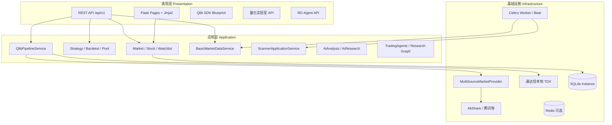

# Quant Atlas 量化研究监控平台 — 综合文档

本文档汇总 **架构**、**目录**、**特点与功能**、**用户价值**、**使用说明**、**部署与运维** 及 **环境变量** 等，便于研发、运维与业务使用者查阅。  
应用对外品牌名为 **Quant Atlas**（代码与配置中亦沿用 `quant_atlas` 等标识）。

---

## 目录

1. [平台概述](#1-平台概述)  
2. [系统架构](#2-系统架构)  
3. [技术栈](#3-技术栈)  
4. [项目目录说明](#4-项目目录说明)  
5. [平台特点](#5-平台特点)  
6. [功能清单](#6-功能清单)  
7. [用户价值与优势](#7-用户价值与优势)  
8. [使用手册](#8-使用手册)  
9. [部署文档](#9-部署文档)  
10. [环境变量参考](#10-环境变量参考)  
11. [开发与测试](#11-开发与测试)  
12. [相关文档索引](#12-相关文档索引)

---

## 1. 平台概述

**Quant Atlas** 是一套面向 A 股为主、可扩展港股/美股等市场的 **量化研究 + 行情监控 + 策略回测 + AI 研究辅助** 的一体化 Web 平台。  

- **表现层**：Flask + Jinja2 模板 + Bootstrap 4，提供登录、仪表盘、个股详情、回测、选股、龙虎榜/研报、消息中心、研究闭环等页面。  
- **应用层**：按领域划分的 Application Service（行情、自选股、策略、回测、Qlib 管线、基础数据、扫描器、用户等），通过 `bootstrap.create_app` 统一装配。  
- **领域与基础设施**：多数据源行情 Provider、SQLite 持久化、Redis（缓存/消息/Celery）、可选 Qlib 与 RD-Agent、LangGraph 研究 Agent 等。

**主入口**：项目根目录 `run.py`，工厂函数为 `app.create_app()` / `app.bootstrap.create_app()`。

---

## 2. 系统架构

### 2.1 逻辑分层



### 2.2 请求与数据流（简）

1. 浏览器访问页面 → Flask-Login 校验会话 → 渲染模板或调用同源 API（`fetch` / jQuery）。  
2. API 路由（`/api/v1/...`）经 `create_api_blueprint` 注入各 Service，返回统一 JSON 结构（成功体含 `data`，错误经 `register_api_error_handlers` 处理）。  
3. 行情类请求优先走 **多源 Provider**（含 AkShare、腾讯网关、可选通达信本地日线合并等），结果可写入 **StockCache / SQLite / Qlib CSV**。  
4. 后台 **扫描器** 可在进程内线程运行，或在 `ENABLE_CELERY=1` 时由 **Celery Beat + Worker** 触发，避免与线程模式重复拉取。  
5. **基础数据**（龙虎榜、研报 HTML、财报快照等）可由 `BasicDataScheduler` 或 Celery 定时任务写入 SQLite。

### 2.3 异步与消息

- **Celery**（`app/celery_app.py`）：Broker/Result 默认 Redis；任务包括龙虎榜/研报定时、行情扫描、Qlib 增量管线、存量回填、因子 IC 监控等。  
- **任务消息中心**：Worker 通过信号向 Redis 列表写入任务生命周期事件，Web 端「消息中心」轮询 `task-messages` 类 API 展示（`task_message_store`）。

### 2.4 安全与角色

- 部分 API 区分 **研究型写操作**、**数据入库**、**高成本 AI**，需角色为 `admin` / `developer` / `researcher`（见 `routes.py` 中 `_require_*` 与 `SessionUser`）。  
- 生产环境务必修改默认密钥与管理员密码（见 [8.2](#82-登录与账号)）。

---

## 3. 技术栈

| 类别 | 技术 |
|------|------|
| 语言与运行时 | Python 3.12+（建议与 CI/本机一致） |
| Web | Flask 2.x、Flask-Login |
| 数据 | pandas、numpy、akshare、yfinance、可选 pytdx（通达信扩展） |
| 缓存 | Redis、内存；SQLite 用于应用状态/用户/自选股等 |
| 异步 | Celery 5.x |
| AI / Agent | LangChain、LangGraph、Pydantic v2；可选 Ollama 适配器 |
| 量化扩展 | Qlib（见 `requirements-qlib.txt`）、自研 Qlib 管线与 dump |
| 前端 | Bootstrap 4、jQuery、各页内联/块脚本 |

---

## 4. 项目目录说明

**`app/` 内分层、命名、`services` 与 `application/services` 区别、SOLID 实践要点**：见 [`app/README.md`](../app/README.md)（建议在扩展功能前阅读）。

以下为 **仓库主干** 说明；`TradingAgents-CN-lastest` 为可选子项目/参考实现，部署主站时可按需忽略或单独阅读其 README。

```
quant-atlas/
├── run.py                      # Flask 启动入口（开发: python run.py）
├── requirements.txt            # 核心 Python 依赖（含 Celery）
├── requirements-qlib.txt       # 可选：Qlib 相关
├── app/                        # 主应用包（推荐以此为准）
│   ├── __init__.py             # create_app 导出、扩展预热
│   ├── config.py               # BASE_DIR、AppSettings.from_env()
│   ├── bootstrap.py            # 依赖装配、蓝图注册、后台线程/Celery 策略
│   ├── celery_app.py           # Celery 应用与 Beat 调度
│   ├── core/                   # 日志、引擎等横切能力
│   ├── domain/                 # 实体、枚举、端口接口
│   ├── application/services/   # 应用服务（业务编排）
│   ├── infrastructure/         # 仓储、Provider、Qlib、TDX、RD-Agent、消息
│   ├── presentation/           # Web 页面、API、quant_lab/qlib/rdagent 路由
│   ├── services/               # 行情访问、回测桥、新闻等
│   ├── tasks/                  # Celery 任务（行情、Qlib、回填、扫描等）
│   ├── tools/                  # Agent 侧 quant_tools 等
│   └── agents/                 # TradingAgents / LangGraph 研究图
├── static/                     # 静态资源
├── instance/                   # 运行时数据（SQLite、Qlib 导出、日志、RD 工件等，勿提交敏感库）
├── tests/                      # pytest 单测
├── docs/                       # 设计与路线图、使用指南、数据流(DATA_FLOW)、本手册
├── scripts/                    # 历史/辅助脚本（旧版 web_app 等，新部署以 app/ 为准）
├── stock-analysis/             # 独立分析脚本子树（通达信读写等）
├── config/                     # 可版本管理的配置：settings、models、定价、model_registry、用户/自选/分组种子 JSON
└── TradingAgents-CN-lastest/   # 可选：TradingAgents-CN 参考工程
```

**关键路径**

- 模板：`app/presentation/web/templates/`  
- 页面路由：`app/presentation/web/pages.py`  
- REST API：`app/presentation/api/routes.py`（前缀 `/api/v1`）  
- 实例数据目录：`instance/`（与 `app.config` 中 `sqlite_path`、`INSTANCE_DIR` 一致：主库、新闻归档、stock_cache、龙虎榜库等）。  
- 静态配置目录：`config/`（`AppSettings` 中用户/自选/分组种子 JSON、`model_registry.json`、**`qlib_config.yaml` / `qlib_config.local.yaml`**、**`qlib_pipeline_meta.json`**、**`rdagent_registry/`**、**`rdagent_jobs/`** 等）。旧路径 `instance/model_registry.json` 与 `instance/qlib_pipeline_meta.json` 会在首次访问时复制到 `config/`；`instance/rdagent_*` 目录会在首次加载时 **整目录迁移** 到 `config/` 下同名路径。

---

## 5. 平台特点

- **多数据源行情**：统一抽象下的多源拉取与降级，降低单源限流或故障影响。  
- **通达信本地协同**：配置 `TDX_ROOT_PATH` 后可合并本地日线等能力（见代码中 TDX 与 Qlib 管线）。  
- **策略与回测**：内置策略提供方与回测引擎桥接，Web 端回测与量化实验室联动。  
- **Qlib 可选管线**：CSV 导出、dump bin、与研究/选股数据源衔接（受 `ENABLE_QLIB` 等开关控制）。  
- **基础数据中心**：龙虎榜、东方财富研报列表、财报快照表等，支持 Celery 定时与「无存量才全量」回填。  
- **行情扫描**：核心池高频 + 全市场轮询可配置；线程模式与 Celery 模式二选一或协调使用。  
- **用户与权限**：基于角色的 API 与功能 gating，适配投研团队分工。  
- **消息中心**：异步任务状态聚合，便于运维与研究员感知定时任务结果。

---

## 6. 功能清单

### 6.1 Web 页面（均需登录，除登录页）

| 路径 | 说明 |
|------|------|
| `/` | 首页仪表盘 |
| `/market-panorama` | 市场全景 |
| `/self-stocks` | 自选股 |
| `/backtest` | 策略回测 |
| `/quant-lab` | 量化实验室 |
| `/research-pipeline` | 研究闭环 |
| `/longhu-bang` | 龙虎榜 |
| `/yanbao-hub` | 研报中心 |
| `/message-center` | 消息中心（任务事件等） |
| `/long-term-select` | 中长线选股 |
| `/stock-selector` | 选股器 |
| `/ai-research-report` | AI 研究报告 |
| `/ai-analysis` | AI 分析 |
| `/optimize` | 优化相关页 |
| `/stock/<symbol>` | 个股详情 |
| `/stocks-manage` | 股票分组管理 |
| `/users-manage` | 用户管理（管理员） |
| `/profile` | 个人中心 |

导航栏已按「行情 / 策略 / 数据 / 选股」分组下拉，管理员入口「用户管理」在右侧。

### 6.2 API 概要

- 主 API：`/api/v1/...`（见 `create_api_blueprint`）  
- Qlib SDK 相关：`/api/v1/qlib/sdk/...`（受 `ENABLE_QLIB` 控制）  
- 量化实验室、RD-Agent：`/api/...` 下各子蓝图（见 `quant_lab_routes`、`rdagent_routes`）  

具体路径以代码为准；研究写操作、数据入库、高成本 AI 接口带角色校验。

### 6.3 Celery 任务（节选）

| 任务名前缀 | 说明 |
|------------|------|
| `app.tasks.market_tasks.*` | 龙虎榜、研报、手动刷新基础数据 |
| `app.tasks.scanner_tasks.*` | 核心池 / 轮询扫描 |
| `app.tasks.qlib_data_update.*` | Qlib 增量管线、无 CSV 时全量种子 |
| `app.tasks.data_backfill_tasks.*` | 财报/龙虎榜/Qlib 存量回填与财报日更 |
| `app.tasks.factor_ic_alerts.*` | 因子 IC 监控（可选 Beat） |

Beat 开关详见 `app/celery_app.py` 文件头注释与下文环境变量表。

---

## 7. 用户价值与优势

**对研究员 / 交易员**

- 统一入口完成 **看行情、管自选股、跑回测、做选股、查龙虎榜与研报**，减少多系统切换。  
- **研究闭环 + 量化实验室** 支持从想法到验证的链路；可选 Qlib / RD-Agent 增强因子与模型实验。  
- **AI 研究报告 / 分析** 在可控权限下辅助解读与起草（实际效果依赖模型与提示词配置）。

**对团队负责人**

- **角色权限** 分离日常交易、投研写入与运维级操作，降低误触生产数据风险。  

### 5.x 风控与回测实盘化（平台特色）

本平台将“风控”作为一等公民能力：尽量把风控逻辑下沉到回测/扫描引擎层，让所有策略天然继承，减少策略作者重复实现、避免遗漏。

#### 5.x.1 全局风控机制（当前已落地）

- **开仓门禁（成交量 + 波动率）**：仅当 `Volume > MA(window) * ratio` 且 `std(pct_change(Close), window) > min` 时允许开仓买入；否则信号被拦截并计入诊断。
  - 配置：`RISK_VOL_MA_WINDOW`、`RISK_VOL_RATIO_MIN`、`RISK_VOLAT_WINDOW`、`RISK_VOLAT_MIN`
- **市场情绪门禁（只卖不买）**：当“市场情绪分”低于阈值时，当天只允许卖出（含止损），禁止开仓买入。
  - 情绪分定义：基于当前已加载全市场行情的**上涨家数占比**（0~100），见 API `GET /api/v1/markets/CN/sentiment`
  - 配置：`RISK_SENTIMENT_GATE`、`RISK_SENTIMENT_MIN_SCORE`（默认 50）
- **止损体系**：
  - **硬止损**：默认 `-8%`（单仓位）
  - **ATR 追踪止损**：`max(hard_stop, highest_since_entry - ATR_MULT * ATR(window))`（默认开启）
  - 配置：`RISK_STOP_LOSS_PCT`、`RISK_TRAILING_ATR`、`RISK_ATR_WINDOW`、`RISK_ATR_MULT`
- **交易成本与滑点（回测实盘化）**：
  - 单边滑点（bps）、买/卖手续费、卖出印花税、最小手续费统一生效
  - 配置：`BT_SLIPPAGE_BPS`、`BT_OPEN_COMMISSION`、`BT_CLOSE_COMMISSION`、`BT_STAMP_DUTY`、`BT_MIN_FEE`
- **仓位风控（按交易所手数规则取整）**：
  - 仓位模式：`full / max_weight / risk / hybrid`
  - `max_weight`：单票最大仓位；`risk`：按风险预算结合初始止损距离换算股数；`hybrid` 同时受两者约束（推荐）
  - A 股默认按 `BT_CN_LOT_SIZE=100` 一手向下取整，尽量避免零散股数
  - 配置：`BT_POSITION_SIZING_MODE`、`BT_MAX_WEIGHT`、`BT_RISK_PER_TRADE`、`BT_CN_LOT_SIZE`
- **组合回测（多标的 + 持仓上限）**：
  - `symbol` 支持逗号分隔多代码，组合回测受 `BT_MAX_POSITIONS` 限制最大持仓数
  - 配置：`BT_MAX_POSITIONS`
- **可成交约束（A 股日频近似）**：
  - 停牌/无量：`Volume<=0` 禁买卖
  - 一字板：`High==Low` 近似禁买卖
  - 涨跌停：按 `BT_LIMIT_THRESHOLD`（默认 9.5%）基于前收判断（涨停禁买、跌停禁卖）
  - 配置：`BT_LIMIT_THRESHOLD`

#### 5.x.2 回测诊断指标（面板展示）

回测结果除收益/回撤等常规指标外，会在 `metrics.diagnostics` 中返回并在回测面板展示：

- `sentiment_score`：市场情绪分（0~100）
- `blocked_buy_liquidity`：被开仓门禁拦截的 BUY 次数
- `blocked_buy_sentiment`：被情绪门禁拦截的 BUY 次数
- `blocked_buy_constraints` / `blocked_sell_constraints`：被可成交约束拦截次数
- `stop_loss_count`：止损次数
- `total_fee` / `total_tax`：费税汇总
- **消息中心 + 任务日志** 提升定时任务可观测性。

**对运维 / 开发**

- **配置驱动**：大量行为由环境变量控制（扫描、Celery、Qlib、调度器开关等）。  
- **分层清晰**：新增数据源或策略主要在 `infrastructure` / `application` 扩展，便于测试（`tests/`）。

**相对仅脚本化量化流程的优势**

- Web 化协作与权限；统一 API；可选分布式定时（Celery）；与本地通达信/AkShare 等组合灵活。

---

## 8. 使用手册

### 8.1 首次访问

1. 按 [9. 部署文档](#9-部署文档) 启动服务。  
2. 浏览器访问 `http://<主机>:5000`（默认端口以 `run.py` 为准）。  
3. 使用管理员账号登录（见下节），**立即修改密码**（通过用户管理或数据库策略，视部署版本而定）。

### 8.2 登录与账号

- 默认种子用户（首次空库）：五类角色各一，密码分别为 **`admin123`**、**`dev123`**、**`research123`**、**`trade123`**、**`view123`**（用户名同角色英文名，见 `SQLiteUserRepository`）。  
- **生产环境必须**修改 `FLASK_SECRET_KEY` 并变更各默认密码；新用户可通过 **`/register`** 自助注册（默认 viewer）。  
- 角色常见取值：`admin`、`developer`、`researcher`、`trader`、`viewer`（见 `user_service` / `SessionUser`）。

### 8.3 导航与功能入口

- **行情**：市场全景、自选股。  
- **策略**：策略回测、量化实验室、研究闭环。  
- **数据**：龙虎榜、研报中心。  
- **选股**：中长线选股、选股器、AI 研究报告。  
- **消息**：异步任务与系统消息提醒（需登录）。  
- **个人中心 / 退出**：右上角；管理员另见「用户管理」。

### 8.4 个股与回测

- 从全景、自选股或选股结果进入 **个股详情**（`/stock/<code>`）。  
- **回测页** 选择策略、标的、区间等（具体字段以页面为准）；结果依赖历史数据是否已缓存或拉取成功。

### 8.5 权限提示

若接口返回「无权执行研究型写操作」「无权触发数据入库」等，请联系管理员将账号角色调整为 `researcher` 或更高权限角色。

### 8.6 命令行（龙虎榜 / 研报 / 门户新闻）

与 Web、API 同源，在仓库根目录执行（详见 [scripts_inventory.md](scripts_inventory.md) §4）：

```bash
python -m app.cli --help
python -m app.cli longhu [--lookback-days 14]
python -m app.cli yanbao
python -m app.cli portal-eastmoney [--out-dir <路径>] [--limit 50]
python -m app.cli portal-10jqka [--out-dir <路径>] [--limit 50]
```

门户新闻默认 JSON 落在 `instance/portal_news_dump/`（可用 `--out-dir` 覆盖）。

### 8.7 API 使用约定（简）

- 成功响应一般为 JSON，内含业务 `data` 与可选 `meta`。  
- 部分旧客户端可通过 `ENABLE_API_LEGACY_RESPONSE_FIELDS=1` 开启兼容字段（若仍支持）。  
- 需登录的接口请携带会话 Cookie（浏览器同源自动携带）或按后续 SSO 方案集成。

---

## 9. 部署文档

### 9.1 系统要求

- Python **3.12+**（与 `README`、依赖 wheel 匹配）。  
- 网络：拉取行情与第三方接口需访问公网（视数据源策略而定）。  
- **Redis**：推荐安装；用于缓存、Celery Broker、任务消息等。  
- 可选：**通达信** 安装目录，配置 `TDX_ROOT_PATH` 以启用本地日线等能力。

### 9.2 安装依赖

```bash
cd <项目根目录>
python -m venv .venv
# Windows: .venv\Scripts\activate
# Linux/macOS: source .venv/bin/activate
pip install -r requirements.txt
# 可选 Qlib：
# pip install -r requirements-qlib.txt
```

### 9.3 启动 Web（开发/小规模）

```bash
set FLASK_SECRET_KEY=your-long-random-secret   # Linux/macOS: export
python run.py
```

默认监听 `0.0.0.0:5000`，`threaded=True` 便于开发时并发请求。

### 9.4 生产环境建议

- 使用 **gunicorn / waitress / uwsgi** 等 WSGI 服务器托管 `app:create_app()` 返回的 `app`，前置 **Nginx** 做 TLS 与静态资源。  
- 关闭调试：`FLASK_DEBUG=0`。  
- 配置反向代理超时，避免长耗时 AI 或回测被网关过早断开。  
- 定期备份 `instance/` 下 SQLite；若曾自定义 `config/` 下 JSON（种子、模型注册表等）一并纳入备份。

### 9.5 Redis

```bash
# 示例：本机 Redis
redis-server
```

与应用相关的 URL 默认 `redis://localhost:6379/0`，可通过 `CELERY_BROKER_URL`、`CELERY_RESULT_BACKEND`、`TASK_MESSAGE_REDIS_URL` 覆盖。

### 9.6 Celery Worker 与 Beat

```bash
 .\.venv\Scripts\Activate.ps1
# 项目根目录；Windows 建议 solo 池
python -m celery -A app.celery_app:celery worker -l info -P solo
python -m celery -A app.celery_app:celery beat -l info
```

**与进程内调度并存时注意**

- 使用 Beat 跑龙虎榜等时，建议 `ENABLE_BASIC_DATA_SCHEDULER=0`，避免与 `BasicDataScheduler` 重复执行。  
- 使用 Celery 跑扫描时：`ENABLE_CELERY=1`，且通常不设 `SCANNER_FORCE_THREADS=1`；若强制线程扫描，请将 `SCANNER_CELERY_BEAT=0` 以免 Beat 与线程双跑（详见 `celery_app` 注释）。

### 9.7 Qlib 与数据目录

- 安装：`pip install -r requirements-qlib.txt`。  
- 启用：`ENABLE_QLIB=1`。  
- 数据产物多在 `instance/qlib_export`、`qlib_bin` 及 meta JSON（以 `QlibPipelineService` 配置为准）。  
- 夜间增量：`QLIB_CELERY_BEAT=1` 等（见环境变量表）。

### 9.8 通达信

- 设置环境变量 **`TDX_ROOT_PATH`** 为通达信安装根目录（含 `vipdoc` 等标准结构）。  
- 可选安装 **pytdx** 以支持部分扩展读取（见 `requirements.txt` 注释）。

### 9.9 RD-Agent / 因子实验

- `ENABLE_RD_AGENT=1` 开启相关 API 与能力；具体实验流程见 `docs/roadmap_qlib_rd_agent.md`、`docs/qlib_rd_trifecta_playbook.md`。

### 9.10 Docker

主仓库根目录 **未强制提供** 统一 `docker-compose.yml`；`TradingAgents-CN-lastest` 子目录内含独立 Docker 说明，若仅部署本 **Quant Atlas** 主应用，请以 WSGI + Redis + 可选 Worker 镜像自建为主。

---

## 10. 环境变量参考

| 变量 | 含义（摘要） |
|------|----------------|
| `FLASK_SECRET_KEY` | Session 密钥，生产必填 |
| `FLASK_DEBUG` | `1` 开启调试 |
| `QUANT_DATABASE_URI` | SQLAlchemy/SQLite URI，默认 `instance/app_state_sqlite.db` |
| `TDX_ROOT_PATH` | 通达信根目录 |
| `ENABLE_QLIB` | 是否启用 Qlib 相关 API/能力 |
| `ENABLE_RD_AGENT` | RD-Agent 等研究扩展 |
| `ENABLE_BACKGROUND_SCANNER` | 是否启用后台扫描逻辑入口 |
| `ENABLE_CELERY` | 为 `1` 时扫描等可走 Celery（见 bootstrap 判断） |
| `SCANNER_FORCE_THREADS` | 强制进程内线程扫描 |
| `SCANNER_CELERY_BEAT` | `0` 关闭 Beat 中扫描任务 |
| `ENABLE_BASIC_DATA_SCHEDULER` | 进程内基础数据定时；与 Celery 龙虎榜等二选一时建议关 |
| `ENABLE_CELERY` | Celery 集成总开关（与扫描、任务派发相关） |
| `CELERY_BROKER_URL` / `CELERY_RESULT_BACKEND` | Celery 消息与结果后端 |
| `TASK_MESSAGE_REDIS_URL` | 任务消息中心 Redis（默认可同 broker） |
| `QLIB_CELERY_BEAT` | `1` 启用夜间 Qlib 增量管线 |
| `DATA_BACKFILL_BEAT` | `1` 启用无存量时的财报/龙虎榜/Qlib 种子回填调度 |
| `FINANCIAL_DAILY_BEAT` | `1` 启用每日财报快照刷新 |
| `FINANCIAL_FULL_BACKFILL_CODES` / `FINANCIAL_DAILY_CODES` / `FINANCIAL_DAILY_MAX_CODES` | 财报回填/日更股票列表 |
| `QLIB_FULL_BACKFILL_SYMBOLS` | 无 CSV 时 Qlib 全量种子标的 |
| `FACTOR_IC_CELERY_BEAT` / `FACTOR_IC_WARN` | 因子 IC 监控定时与阈值 |
| `ENABLE_API_LEGACY_RESPONSE_FIELDS` | API 兼容旧字段 |
| `WECHAT_OPEN_APP_ID` / `WECHAT_OPEN_APP_SECRET` | 微信开放平台网站应用（扫码登录）；未配置则登录页不显示微信入口 |
| `WECHAT_REDIRECT_URI` | 可选；授权回调根 URL（与开放平台「授权回调域」一致），缺省时用当前请求的站点根 + `/auth/wechat/callback` |

（完整说明以 `app/config.py`、`app/celery_app.py` 及代码注释为准。）

**账号体系**：内置五类角色（`admin` / `developer` / `researcher` / `trader` / `viewer`）各对应一个演示账号；开放注册路径为 `/register`，新用户固定 **viewer**；管理员在「用户管理」中可 **修改任意用户的角色**（含演示账号），演示账号不可删除。

---

## 11. 开发与测试

```bash
pip install -r requirements.txt
pytest tests/ -q
```

重点模块可针对性运行，例如：

```bash
pytest tests/test_auth_login_flow.py tests/test_qlib_pipeline.py -q
```

---

## 12. 相关文档索引

| 文档 | 内容 |
|------|------|
| **`docs/option_1_9.md`** | **Option 1–9 演进纪要 + V1–V9 集成验收（唯一收口）** |
| `docs/QUANT_ATLAS_V1_V9_集成验收.md` | 跳转至 `option_1_9.md` |
| `README.md` | 项目简介与快速开始（部分描述 legacy `scripts/`，新架构以 `app/` 与本手册为准） |
| `docs/scripts_inventory.md` | `scripts/`、`stock-analysis/`、`TradingAgents-CN-lastest` 与主平台对照及迁移状态 |
| `docs/DATA_FLOW.md` | **数据流与本地优先**：缓存/SQLite/Qlib CSV·bin、定时频度、环境变量 |
| `docs/LEGACY_STATUS.md` | 废弃 API 与旧入口说明 |
| `docs/roadmap_qlib_rd_agent.md` | Qlib + RD-Agent 路线图 |
| `docs/qlib_rd_trifecta_playbook.md` | 研究三角战术手册 |
| `docs/agents_self_contained.md` | Agent 自包含说明 |
| `docs/case.md` / `docs/ROADMAP_FROM_CASE.md` | 案例与路线 |
| `stock-analysis/README.md` | 子目录分析脚本说明 |
| `REFACTORING_LOG.md` | 重构记录（若有） |

### 12.1 版本演进速查（V4–V9）

| 版本 | 一句话 |
|------|--------|
| V4 | EventBus + 数据真值 + 辩论仲裁 + 行为拓扑 |
| V5 | 因果链 SequenceChain + Jarvis 主动预测 |
| V6 | 多租户协作 + 跨团队元学习 |
| V7 | Swarm 编排 + 叙事/War Room/语音/Jarvis |
| V8 | 元仲裁 + 团队流水线 + 决策回溯 3D |
| V9 | Mesh 联邦 + 无界执行 + Hyper-Sim + 真值守卫 + 决策剧场 |

集成验收见 `docs/option_1_9.md` §3。

---

## 附录 A：许可证

以仓库根目录 **LICENSE** 或 **README** 声明为准（常见为 MIT）；使用第三方数据源请遵守各数据提供方条款。

---

## 附录 B：文档维护

- 代码变更后请同步更新本手册中的 **路径、环境变量、端口与默认账号** 等事实性描述。  
- 若拆分章节为独立文件，建议在本文件顶部保留 **索引链接** 避免重复维护。

---

*文档生成基于当前仓库代码结构整理；如有出入以源码为准。*
