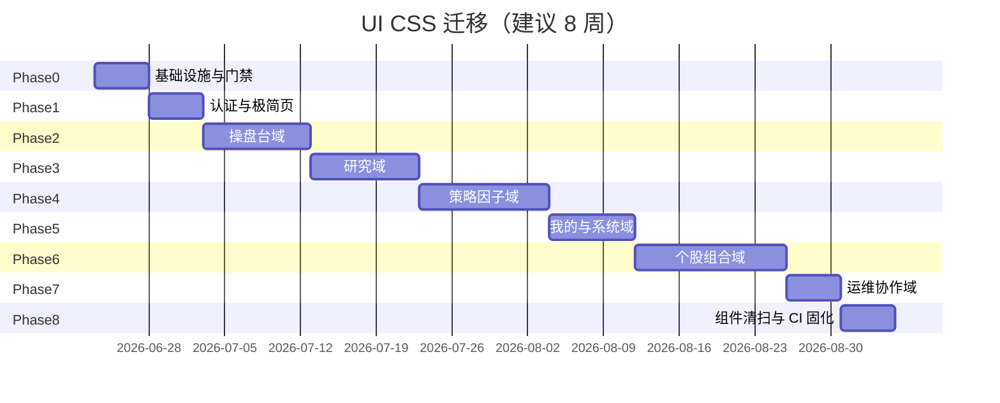

# Quant Atlas 全站 UI / CSS 迁移计划

> 目标：全站页面统一 **夜间量化终端 + 日间机构研究台** 双主题；**页面 HTML 内不写 `<style>`、尽量不用 `style=""`**，优先 `design-tokens.css` → `common.css` → 域级 CSS；仅图表/画布/第三方等特殊场景保留页级 CSS。

**基准参考**：`tmp/design/`、`/ui-showcase`、`static/css/design-tokens.css`、`common.css`、`quant-atlas-layout.css`  
**制定日期**：2026-06-20  
**范围**：`app/presentation/web/templates/` 下全部路由页（约 **85** 个顶层模板 + **5** 个带 `<style>` 的组件）

---

## 0. 迁移完成状态（2026-06-20 更新）

| 指标 | 计划基准 | **当前** |
|------|----------|----------|
| 顶层/组件模板含 `<style>` 块 | 78+ | **0**（`error_*.html` 除外；`login`/`register` 已外置至 `pages/auth.css`） |
| 静态 `style=""` | ~1,200+ | **41**（均为动态/宏，见 §0.1） |
| `static/css/pages/` 域 CSS | 0 | **20** 文件（含 `auth.css`） |
| 清扫脚本 | — | `scripts/deep_inline_cleanup_batch*.py`（batch4–10） |

**全站 DoD（2026-06-20）**：

- [x] 路由模板 0 个含 `<style>`（errors + 已外置 auth）
- [x] 静态 `style=""` < 50
- [x] 双主题四路径**结构**验收（`tests/smoke/test_dual_theme_pages.py`）
- [ ] 双主题四路径**视觉**走查（`docs/UI_CSS_THEME_VERIFICATION.md` 人工勾选）
- [x] 新页交付路径：`design-tokens` → `common` → 域 CSS

### 0.1 有意保留的 `style=`（41 处）

| 类别 | 文件 | 说明 |
|------|------|------|
| Jinja 宏随机宽 | `components/skeleton.html`（8） | 骨架屏占位 |
| JS 热力图/联动 | `global_radar.html`（6） | 运行时 `background`/边框色 |
| JS 雷达/评分 | `self_stocks.html`（5） | 柱宽/环色 |
| SVG/组合 | `portfolio_detail.html`（3） | 渐变 stop、行业色 |
| 投委会动态 | `ai_investment_committee.html`（3） | 冲突条/投票/气泡色 |
| Pine Script 字符串 | `nl_strategy.html`（2） | `style=shape.*`，非 HTML |
| Alpine 动画/灯色 | `evidence_card.html`、`resonance_meter.html`、`live_research_lab.html` | `:style` / `animation-delay` |
| 单处动态 | `portfolio`、`selection_result`、`signal_observations`、`stock_selector`、`factor_detail`、`ai_hedge_fund`、`swarm_dashboard`、`strategy_compare`、`truth_droplet`、`agent_center` | 柱高/宽/DAG 定位/图例色等 |

---

## 1. 现状审计

### 1.1 规模

| 指标 | 数量 |
|------|------|
| 顶层 HTML 模板 | ~85 |
| 含 `<style>` 块 | **78** |
| 含 `` | **66** |
| 含 `style=` 内联 | **~1,200+**（`stock_detail` 单页 101 处） |
| 独立 CSS 文件（`static/css/`） | 5（tokens / common / layout / fonts / zen-finance） |

### 1.2 布局壳（4 类）

| 壳 | 基模板 | 适用页 | 备注 |
|----|--------|--------|------|
| **A 标准** | `base.html` | ~75 页 | 顶栏 `app-shell` + `page-wrap` |
| **B 极简** | `layouts/minimal_base.html` | 少数独立页 | 无顶栏 |
| **C 设计展示** | `layouts/design_showcase_base.html` | `ui_showcase` | 三栏 `qa-*`，已完成 |
| **D Zen** | `layouts/zen_base.html` + `zen-finance.css` | `zen_terminal` 等 | 独立视觉子品牌 |

### 1.3 CSS 债务 TOP 10（优先治理）

| 模板 | 行数 | 内联 style | 说明 |
|------|------|------------|------|
| `stock_detail.html` | 2631 | 101 | 个股工作台，组件多 |
| `ai_hedge_fund.html` | 1500 | 11 | 多智能体面板 |
| `alpha_factory.html` | 1285 | 87 | 实验/流水线 UI 密集 |
| `daily_workbench.html` | 1146 | 29 | 首页操盘台 |
| `marketplace.html` | 1064 | 51 | Alpha 市集 SPA |
| `self_stocks.html` | 807 | 29 | 表格 + 卡片 |
| `signal_observations.html` | 798 | 9 | 观察队列 |
| `swarm_designer_flow.html` | 796 | 0 | 含 xyflow 画布 |
| `run_history.html` | 792 | 6 | 时间线 |
| `global_radar.html` | 677 | 39 | 热力图/地图 |

### 1.4 共享组件含 `<style>`（须同步迁移）

| 组件 | 说明 |
|------|------|
| `components/stock/workspace_shell.html` | 个股页壳 |
| `components/strategy/evidence_card.html` | 证据卡 |
| `components/risk/trading_dna_spiral.html` | SVG 动画 |
| `components/wisdom/wisdom_mesh_browser.html` | 图谱 |
| `components/skeleton.html` | 骨架屏 |

---

## 2. 目标架构

### 2.1 CSS 分层（强制加载顺序）

```
1. css/fonts.css
2. css/design-tokens.css      ← 仅变量 + qa-badge/qa-toast 等原子 token 组件
3. css/common.css             ← 全站通用：按钮、卡片、表格、导航、工具类
4. css/quant-atlas-layout.css ← 可选：三栏机构工作台 qa-* / layout-ref
5. css/pages/<domain>.css     ← 域级：仅该域多页复用的布局/区块
6. css/pages/<page>.css       ← 页级：仅当 5 无法覆盖且经评审批准
```

**禁止**：在 HTML 中写 `<style>`（错误页、邮件模板除外）。  
**限制**：`style=""` 仅允许动态 JS 写入（如热力图色块 `background-color`），静态 markup 一律用 class。

### 2.2 HTML 结构约定

**标准页（壳 A）** — 保持 `base.html`，内容区统一：

```html

<section class="section-shell hero-section">…</section>
<div class="stat-grid">…</div>
<div class="grid-auto">…</div>

```

**机构密集页（可选升级）** — 引入 `quant-atlas-layout.css`，局部使用 `qa-card` / `qa-grid` / `qa-row`，**不**替换全站顶栏（阶段 3 后再评估左侧轨导航）。

**宏与片段** — 扩展 `components/ui_macros.html`：

- `qa_page_hero(title, subtitle, actions)`
- `qa_stat_grid(items)`
- `qa_panel(title, body)`
- `qa_detail_row(label, value, tone)`

### 2.3 何时允许页级 / 特殊 CSS

| 场景 | 处理方式 | 文件示例 |
|------|----------|----------|
| ECharts / TradingView / Canvas 尺寸 | 页级 CSS 仅 `width/height/min-height` | `pages/charts.css` |
| xyflow / mermaid / Three.js 容器 | 页级 + vendor | `swarm_designer_flow.css` |
| 热力图单元格动态色 | JS 写 `style` 或 CSS 变量 | `global_radar` |
| Zen 子品牌 | 保留 `zen-finance.css`，token 对齐 dark 主题 | 不并入 common |
| 打印 / PDF 导出 | 独立 `@media print` 块 | `pages/print.css` |

---

## 3. 迁移阶段总览



---

## 4. Phase 0 — 基础设施（第 1 周）

**目标**：工具链与共享 CSS 补齐，后续迁移有处可收拢。

| 任务 | 产出 |
|------|------|
| P0.1 抽取 `common.css` 中重复模式 | 新增 `.page-hero`、`.domain-hero`（合并各页 `*-hero`） |
| P0.2 建立 `static/css/pages/` 目录 | `_index.css` 按域 `@import`（构建期或手工 link） |
| P0.3 扩展 `ui_macros.html` | 5+ 宏覆盖 hero / stat / panel |
| P0.4 CI 门禁（软） | 脚本统计 templates 下 `<style` 数量，超基线 warn |
| P0.5 迁移检查清单模板 | 每 PR 勾选（见 §7） |

**验收**：`/ui-showcase` 双主题无回归；`common.css` 新增 hero 变体可在 1 个试点页验证。

---

## 5. 分域页面清单与波次

### Phase 1 — 认证与极简页（5 页，低风险）

| 路由 | 模板 | 布局壳 | 当前 CSS | 迁移动作 |
|------|------|--------|----------|----------|
| `/login` | `login.html` | 独立 | `<style>` | → `pages/auth.css`，对齐 token |
| `/register` | `register.html` | 独立 | `<style>` | 同上 |
| `/share/decision/<token>` | `decision_snapshot_public.html` | minimal | 无 | 仅用 common |
| 404/500 | `error_*.html` | 无 | 内联 | → `pages/errors.css` |
| `feature_retired` | `feature_retired.html` | base | 内联 | common 工具类 |

**用户分层占位页**（已基本合规，仅抽查）：`user_tiers_*.html`（4 页）

---

### Phase 2 — 操盘台域（11 页，高曝光）

| 路由 | 模板 | 内联 | 目标 CSS | 优先级 |
|------|------|------|----------|--------|
| `/` | `daily_workbench.html` | 29 | `pages/workbench.css` | P0 |
| `/dashboard` | `index.html` | 22 | 合并入 workbench | P1 |
| `/self-stocks` | `self_stocks.html` | 29 | `pages/market.css` | P0 |
| `/market-panorama` | `market_panorama.html` | 25 | `pages/market.css` | P0 |
| `/global-radar` | `global_radar.html` | 39 | `pages/market.css` + 热力图例外 | P0 |
| `/hot-sectors` | `hot_sectors.html` | 5 | `pages/market.css` | P1 |
| `/tdx-blocks` | `tdx_blocks.html` | 7 | `pages/market.css` | P1 |
| `/longhu-bang` | `longhu_bang.html` | 11 | `pages/market.css` | P1 |
| `/yanbao-hub` | `yanbao_hub.html` | 6 | `pages/market.css` | P1 |
| `/ui-showcase` | `ui_showcase.html` | 6 | **已完成**（清理剩余内联） | P2 |
| `/architecture-roadmap` | `architecture_roadmap.html` | 7 | `pages/system.css` | P2 |

**域 CSS 要点**：`.market-heatmap-cell`、`.panorama-table`、`.wb-card` 已在 common 有别名，迁到 `pages/market.css` 统一。

---

### Phase 3 — 研究 / AI 域（22 页）

| 路由 | 模板 | 内联 | 目标 CSS | 备注 |
|------|------|------|----------|------|
| `/ai-committee` | `ai_investment_committee.html` | 26 | `pages/research.css` | |
| `/ai-committee-dashboard` | `ai_committee_dashboard.html` | 41 | 同上 | |
| `/ai-committee-selection` | `ai_committee_selection.html` | 6 | 同上 | |
| `/ai-analysis` | `ai_analysis.html` | 9 | 同上 | |
| `/ai-research-report` | `ai_research_report.html` | 1 | 同上 | |
| `/ai-chat` | `ai_chat.html` | 2 | 同上 | |
| `/ai-hedge-fund` | `ai_hedge_fund.html` | 11 | `pages/research.css` | 大页拆分组件 |
| `/research-pipeline` | `research_pipeline.html` | 11 | 同上 | mermaid 容器例外 |
| `/quant-lab` | `quant_lab.html` | 13 | 同上 | |
| `/research-canvas` | `research_canvas.html` | 1 | `pages/research-canvas.css` | 画布 |
| `/war-room` | `war_room.html` | 0 | `pages/research.css` | |
| `/voice-briefing` | `voice_briefing.html` | 1 | 同上 | |
| `/decision-replay-space` | `decision_replay_space.html` | 4 | 同上 | |
| `/swarm-dashboard` | `swarm_dashboard.html` | 9 | `pages/swarm.css` | |
| `/swarm-designer` | `swarm_designer.html` | 4 | 同上 | |
| `/swarm-designer-flow` | `swarm_designer_flow.html` | 0 | 同上 + vendor | xyflow |
| `/agent-center` | `agent_center.html` | 2 | `pages/research.css` | |
| `/agent-lab` | `agent_lab.html` | 1 | 同上 | |
| `/nl-strategy` | `nl_strategy.html` | 12 | `pages/research.css` | |
| — | `nl_strategy_v2.html` | 3 | 合并或废弃 | 确认路由 |
| `/experiment-reporter` | `experiment_reporter.html` | 1 | `pages/research.css` | |
| `/truth-droplet` | `truth_droplet.html` | 1 | `pages/truth.css` | |

---

### Phase 4 — 策略 / 因子域（18 页）

| 路由 | 模板 | 内联 | 目标 CSS |
|------|------|------|----------|
| `/backtest` | `backtest.html` | 37 | `pages/strategy.css` |
| `/optimize` | `optimize.html` | 0 | 同上 |
| `/strategy-compare` | `strategy_compare.html` | 2 | 同上 |
| `/attribution-dashboard` | `attribution_dashboard.html` | 10 | 同上 |
| `/strategy-snapshots` | `strategy_snapshots.html` | 4 | 同上 |
| `/stock-selector` | `stock_selector.html` | 20 | `pages/strategy.css` |
| `/long-term-select` | `long_term_select.html` | 7 | 同上 |
| `/signal-flag` | `signal_flag.html` | 5 | 同上 |
| `/signal-observations` | `signal_observations.html` | 9 | 同上 |
| `/alpha-factory` | `alpha_factory.html` | 87 | `pages/alpha-factory.css` |
| `/factor-evolution` | `factor_evolution.html` | 18 | `pages/factor.css` |
| `/factor-repository` | `factor_repository.html` | 6 | 同上 |
| `/factor/<id>` | `factor_detail.html` | 4 | 同上 |
| `/strategy-wizard` | `strategy_wizard.html` | 8 | `pages/strategy-wizard.css` |
| `/data-lake-health` | `data_lake_health.html` | 5 | `pages/data-lake.css` |
| `/professional-workbench` | `professional_workbench.html` | 11 | `pages/strategy.css` |
| `/alpha-marketplace` | `marketplace.html` | 51 | `pages/marketplace.css` |
| — | `collaboration_workspace.html` | 0 | common | 内容少 |

---

### Phase 5 — 我的 / 系统 / 用户域（16 页）

| 路由 | 模板 | 内联 | 目标 CSS |
|------|------|------|----------|
| `/retail-assistant` | `retail_assistant.html` | 21 | `pages/user.css` |
| `/user-spectrum-hub` | `user_spectrum_hub.html` | 6 | 同上 |
| `/zen-terminal` | `zen_terminal.html` | 3 | **保留** `zen-finance.css` |
| `/zen-dashboard` | `zen_dashboard.html` | 10 | 同上 |
| `/portfolio-resonance` | `portfolio_resonance.html` | 3 | 同上 |
| `/profile` | `profile.html` | 13 | `pages/user.css` |
| `/message-center` | `message_center.html` | 19 | 同上 |
| `/moments` | `moments.html` | 16 | 同上 |
| `/integration-hub` | `integration_hub.html` | 19 | `pages/system.css` |
| `/capabilities` | `capabilities.html` | 18 | 同上 |
| `/observability` | `observability.html` | 3 | 同上 |
| `/task-center` | `task_center.html` | 7 | 同上 |
| `/alert-center` | `alert_center.html` | 3 | 同上 |
| `/task/<id>` | `task_detail.html` | 1 | 同上 |
| `/portfolio` | `portfolio.html` | 20 | `pages/portfolio.css` |
| `/user-tiers/boutique` 等 | 4 页 | 0 | common |

---

### Phase 6 — 个股 / 组合 / 交易域（12 页，最难）

| 路由 | 模板 | 内联 | 目标 CSS | 策略 |
|------|------|------|----------|------|
| `/stock/<symbol>` | `stock_detail.html` | **101** | `pages/stock-detail.css` + 组件 CSS | **拆分组件**；`workspace_shell` 先迁 |
| `/portfolio/<id>` | `portfolio_detail.html` | 22 | `pages/portfolio.css` | |
| `/selection-result/<id>` | `selection_result.html` | 13 | 同上 | |
| `/investment-managers` | `investment_managers.html` | 8 | `pages/portfolio.css` | |
| `/investment-managers/<id>` | `investment_manager_detail.html` | 7 | 同上 | |
| `/decision-snapshot/<id>` | `decision_snapshot.html` | 0 | common | |
| `/shadow-account` | `shadow_account.html` | 11 | `pages/trading.css` | |
| `/expert-teams` | `expert_teams.html` | 10 | 同上 | |
| `/run-history` | `run_history.html` | 6 | 同上 | |
| `/collaboration` | `collaboration_workspace.html` | 0 | common | |
| `/stocks-manage` | `stocks_manage.html` | 5 | `pages/admin.css` | |
| `/users-manage` | `users_manage.html` | 1 | 同上 | |

---

### Phase 7 — 运维 / 管理剩余（已含于 Phase 5/6 的并入 Phase 8 清扫）

---

### Phase 8 — 组件与 CI 固化

1. 5 个 components 去掉 `<style>` → `static/css/components/*.css`
2. `partials/` 内联 style 清零
3. CI：`<style` 块数 ≤ 2（仅 `error` + 允许的 vendor 注入）
4. 视觉回归：双主题截图对比（`/ui-showcase` + `daily_workbench` + `stock_detail`）

---

## 6. 单页迁移标准流程（SOP）

每页一个 PR，按顺序执行：

```
□ 1. 盘点：记录 <style> 行数、style= 数量、独有 class 列表
□ 2. 映射：每个独有 class → common 已有？→ pages/<domain>.css？→ 新建？
□ 3. 替换：hero → .hero-section 或 .qa-hero；卡片 → .qa-card / .card；状态 → .qa-badge / .status-*
□ 4. 删除： 内 <style> 整块移除
□ 5. 引入： 仅保留 <link href="pages/xxx.css">（若需要）
□ 6. 主题：抽测 dark/light 切换；检查 [data-theme="light"] 覆盖
□ 7. 响应：640 / 820 / 1180 三断点目视或 Playwright
□ 8. 记录：REFACTORING_LOG.md 一行 + 本计划表勾选
```

---

## 7. 域级 CSS 文件规划

| 文件 | 预估行数 | 吸收页面 class 前缀 |
|------|----------|----------------------|
| `pages/workbench.css` | ~200 | `.wb-*`, `.hero-grid`, `.weather-*` |
| `pages/market.css` | ~350 | `.pano-*`, `.heatmap-*`, `.macro-*` |
| `pages/research.css` | ~400 | `.committee-*`, `.agent-*`, `.pipeline-*` |
| `pages/strategy.css` | ~300 | `.bt-*`, `.score-*`, `.diag-*` |
| `pages/alpha-factory.css` | ~250 | `.af-*` |
| `pages/factor.css` | ~150 | `.factor-*` |
| `pages/marketplace.css` | ~200 | `.mp-*` |
| `pages/stock-detail.css` | ~400 | `.sd-*`, 图表区 |
| `pages/portfolio.css` | ~200 | `.pf-*` |
| `pages/user.css` | ~200 | `.ra-*`, `.profile-*` |
| `pages/system.css` | ~250 | `.cap-*`, `.obs-*`, `.hub-*` |
| `pages/auth.css` | ~80 | `.login-*` |
| `pages/swarm.css` | ~120 | 画布容器 |
| `components/evidence-card.css` | ~60 | 证据卡 |
| `components/workspace-shell.css` | ~100 | 个股壳 |

**原则**：域内第二页复用同一 class 时，从页级提升到域级；第三域复用再考虑升入 `common.css`。

---

## 8. base.html 统一改造（横切，Phase 2 并行）

| 项 | 说明 |
|----|------|
| 主题切换 | 已有 `#themeToggle` + `base_app.js`，保持 |
| 导航样式 | 已用 token，仅清理 `base.html` 内 23 处 `style=` |
| 可选 link | **不**默认全站加载 `quant-atlas-layout.css`，按页引入 |
| Bootstrap | 逐步用 common 工具类替代 Bootstrap 布局类（长期） |

---

## 9. 风险与依赖

| 风险 | 缓解 |
|------|------|
| `stock_detail` 拆分引入回归 | 先组件 CSS 外置，不改 DOM 结构 |
| 图表高度硬编码 | 统一 `--chart-height-lg: 480px` 等 token |
| Zen 与主站视觉分裂 | Zen 仅同步 token 数值，不强制 layout 一致 |
| 多人并行改 common | 域 CSS 优先，common 变更需 code review |
| Bootstrap 与 qa-* 并存 | 迁移期允许，最终保留一种按钮体系 |

---

## 10. 里程碑与完成定义（DoD）

| 里程碑 | 日期（建议） | 完成定义 |
|--------|--------------|----------|
| M0 基础设施 | +1 周 | `pages/` 目录 + 宏 + CI warn |
| M1 操盘台域零 `<style>` | +2 周 | Phase 2 全部完成 |
| M2 研究+策略域 | +5 周 | Phase 3–4 完成 |
| M3 个股页 | +7 周 | `stock_detail` 无 `<style>`，内联 style < 10 |
| M4 全站 | +8 周 | 顶层模板 `<style>` 仅 errors；组件外置完成 |

**全站 DoD**：

- [x] 85 个顶层模板中 0 个含 `<style>`（`error_*.html` 除外；auth 已外置）
- [x] 静态 `style=""` 总量 < 50（仅动态数据可视化，当前 **41**）
- [ ] 双主题在导航、操盘台、个股、回测四路径无肉眼错位
- [x] 所有新页仅通过 `design-tokens` + `common` + 域 CSS 交付

---

## 11. 附录：全量路由 ↔ 模板索引

<details>
<summary>点击展开 85+ 路由映射</summary>

| 路由 | 模板 | Phase |
|------|------|-------|
| `/` | daily_workbench.html | 2 |
| `/dashboard` | index.html | 2 |
| `/login` | login.html | 1 |
| `/register` | register.html | 1 |
| `/ui-showcase` | ui_showcase.html | ✅ |
| `/ui-showcase/light` | ui_showcase.html | ✅ |
| `/self-stocks` | self_stocks.html | 2 |
| `/market-panorama` | market_panorama.html | 2 |
| `/global-radar` | global_radar.html | 2 |
| `/hot-sectors` | hot_sectors.html | 2 |
| `/tdx-blocks` | tdx_blocks.html | 2 |
| `/longhu-bang` | longhu_bang.html | 2 |
| `/yanbao-hub` | yanbao_hub.html | 2 |
| `/backtest` | backtest.html | 4 |
| `/optimize` | optimize.html | 4 |
| `/capabilities` | capabilities.html | 5 |
| `/integration-hub` | integration_hub.html | 5 |
| `/observability` | observability.html | 5 |
| `/architecture-roadmap` | architecture_roadmap.html | 2 |
| `/ai-hedge-fund` | ai_hedge_fund.html | 3 |
| `/alpha-factory` | alpha_factory.html | 4 |
| `/factor-evolution` | factor_evolution.html | 4 |
| `/ai-committee` | ai_investment_committee.html | 3 |
| `/ai-committee-dashboard` | ai_committee_dashboard.html | 3 |
| `/ai-committee-selection` | ai_committee_selection.html | 3 |
| `/nl-strategy` | nl_strategy.html | 3 |
| `/ai-analysis` | ai_analysis.html | 3 |
| `/ai-research-report` | ai_research_report.html | 3 |
| `/ai-chat` | ai_chat.html | 3 |
| `/research-pipeline` | research_pipeline.html | 3 |
| `/factor-repository` | factor_repository.html | 4 |
| `/factor/<id>` | factor_detail.html | 4 |
| `/alpha-marketplace` | marketplace.html | 4 |
| `/strategy-wizard` | strategy_wizard.html | 4 |
| `/data-lake-health` | data_lake_health.html | 4 |
| `/professional-workbench` | professional_workbench.html | 4 |
| `/user-spectrum-hub` | user_spectrum_hub.html | 5 |
| `/zen-terminal` | zen_terminal.html | 5 |
| `/portfolio-resonance` | portfolio_resonance.html | 5 |
| `/zen-dashboard` | zen_dashboard.html | 5 |
| `/collaboration` | collaboration_workspace.html | 4 |
| `/task-center` | task_center.html | 5 |
| `/alert-center` | alert_center.html | 5 |
| `/shadow-account` | shadow_account.html | 6 |
| `/expert-teams` | expert_teams.html | 6 |
| `/run-history` | run_history.html | 6 |
| `/quant-lab` | quant_lab.html | 3 |
| `/agent-center` | agent_center.html | 3 |
| `/swarm-dashboard` | swarm_dashboard.html | 3 |
| `/swarm-designer` | swarm_designer.html | 3 |
| `/swarm-designer-flow` | swarm_designer_flow.html | 3 |
| `/research-canvas` | research_canvas.html | 3 |
| `/war-room` | war_room.html | 3 |
| `/voice-briefing` | voice_briefing.html | 3 |
| `/decision-replay-space` | decision_replay_space.html | 3 |
| `/experiment-reporter` | experiment_reporter.html | 3 |
| `/stocks-manage` | stocks_manage.html | 6 |
| `/users-manage` | users_manage.html | 6 |
| `/profile` | profile.html | 5 |
| `/moments` | moments.html | 5 |
| `/retail-assistant` | retail_assistant.html | 5 |
| `/message-center` | message_center.html | 5 |
| `/task/<id>` | task_detail.html | 5 |
| `/stock/<symbol>` | stock_detail.html | 6 |
| `/strategy-compare` | strategy_compare.html | 4 |
| `/attribution-dashboard` | attribution_dashboard.html | 4 |
| `/strategy-snapshots` | strategy_snapshots.html | 4 |
| `/decision-snapshot/<id>` | decision_snapshot.html | 6 |
| `/share/decision/<token>` | decision_snapshot_public.html | 1 |
| `/long-term-select` | long_term_select.html | 4 |
| `/stock-selector` | stock_selector.html | 4 |
| `/signal-flag` | signal_flag.html | 4 |
| `/signal-observations` | signal_observations.html | 4 |
| `/investment-managers` | investment_managers.html | 6 |
| `/investment-managers/<id>` | investment_manager_detail.html | 6 |
| `/selection-result/<id>` | selection_result.html | 6 |
| `/portfolio/<id>` | portfolio_detail.html | 6 |
| `/user-tiers/boutique` | user_tiers_boutique.html | 1 |
| `/user-tiers/investment` | user_tiers_investment.html | 1 |
| `/user-tiers/fund` | user_tiers_fund.html | 1 |
| `/user-tiers/institution` | user_tiers_institution.html | 1 |
| truth droplet | truth_droplet.html | 3 |

</details>

---

## 12. 建议的下一步（执行入口）

**静态清扫已完成。** 后续可选：

1. **双主题验收**：导航 / 操盘台 / 个股 / 回测 四路径人工走查（DoD 最后一项）
2. **动态样式规范**：新 JS 动态色优先 `CSS 变量` + `element.style.setProperty`，减少裸 `style=` 字符串拼接
3. **CI 门禁**：`python scripts/check_template_inline_styles.py`（已接入 `.github/workflows/ci.yml`）
4. **双主题验收**：见 `docs/UI_CSS_THEME_VERIFICATION.md`

历史执行记录见 `REFACTORING_LOG.md`（2026-06-20 batch4–11）。
