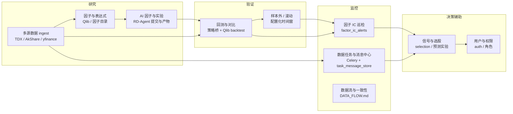

# Quant Atlas：端到端量化研究监控 — 目标与流程

**平台目标**：构建端到端的量化研究监控系统，覆盖 **A 股 / 港股 / 美股 / Crypto**（已接入域模型）及规划中的 **期货、外汇**；支撑 **多源数据 → 因子与模型 → 回测验证 → 运行监控 → 决策辅助**；配套 **用户与角色**。重点缓解 **手动因子工程效率低、多源数据不一致、回测与实盘认知偏差** 三类问题，形成 **「研究 → 验证 → 监控 → 决策」** 闭环。

**技术事实（本仓库主栈）**：Flask 应用工厂 `app/bootstrap.py`、JSON API `/api/v1/*`、SQLite 用户/自选股/基础数据/新闻归档、Celery（行情扫描、Qlib 增量、存量回填、因子 IC 巡检等）、Qlib 管线 `QlibPipelineService` + `app/tasks/qlib_data_update.py`、RD-Agent 编排 `RDAgentRunService` + `app/presentation/routes/rdagent_routes.py` 与 `routes_v1_qlib_rd.py`。下文路线图 **按本仓库路径** 编写，不再以「已改用 FastAPI」为前提。

---

## 1. 「研究 → 验证 → 监控 → 决策」闭环

| 环节 | 要解决的风险 | 本仓库主要落点 |
|------|----------------|----------------|
| 研究 | 手工重复、口径不统一 | `QlibPipelineService`、`BasicMarketDataService`、RD-Agent 注册与 `config/rdagent_*` |
| 验证 | look-ahead、过拟合、回测与数据口径不一致 | Qlib ingest 时间窗、`merge_existing` 策略、策略回测走统一 Provider；新增因子先走 **样本外** 配置再入库 |
| 监控 | 数据静默失败、因子失效不可见 | `DATA_FLOW.md`、`FACTOR_IC_CELERY_BEAT` + `factor_ic_monitor_tick`、任务消息 `task_message_store` |
| 决策辅助 | 信号与权限混乱 | 选股/预测服务 + `AuthService` / 角色；仅输出研究信号，不替代合规实盘流程 |

---

## 2. 能力矩阵：已实现 vs 规划中

| 能力 | 状态 | 说明 |
|------|------|------|
| A 股多源行情与缓存 | 已有 | `MultiSourceMarketProvider`、`stock_cache`、`TDX_ROOT_PATH` |
| Qlib CSV → bin 与增量任务 | 已有 | `qlib_incremental_pipeline`、`qlib_full_backfill_if_empty` 等 |
| 龙虎榜 / 研报 / 新闻归档 | 已有 | `basic_market_data.db`、`news_archive.db`；含独立全量回填任务（见 `DATA_FLOW.md`） |
| 因子 IC 弱信号巡检 | 已有 | `app/tasks/factor_ic_alerts.py`，Beat 可选 |
| RD-Agent 运行与产物 | 已有 | `RDAgentRunService`、API 路由、artifact registry |
| TradingAgents 六角色集成 | 进行中 | `.cursorrules` 目标；工具层走统一数据与回测 |
| 期货 / 外汇统一 `MarketCode` 与 Provider | 规划 | 当前 `MarketCode` 为 CN/US/HK/CRYPTO；扩展需新增枚举 + Provider 实现 + 全景路由 |
| MLflow / W&B 实验追踪 | 规划 | 建议先统一落盘 `instance/` + 任务 meta，再外挂追踪 |
| 实时 WebSocket 推送 | 规划 | 当前以轮询 + Celery 为主 |

---

## 3. 数据一致性与回测防偏差（操作规程）

1. **单一写入主路径**：研究用日 K 以 **`instance/qlib_export` + `qlib_bin`** 为准；页面列表类以 **SQLite 基础库** 为准；勿在同一研究课题混用未对齐的 CSV 快照。详见 [DATA_FLOW.md](DATA_FLOW.md)。
2. **增量与全量**：全量种子仅空库或显式强制任务触发；日常仅跑 **增量管线**，避免与手动全量任务叠峰。
3. **因子与标签**：在 Qlib `DataHandler` / 配置中明确 **标签 horizon** 与 **特征截止时点**；新因子入库前要求 **训练/验证/测试** 三段式时间切分记录入 `config` 或 RD 运行 meta。
4. **交叉验证数据源**：关键字段（复权、停牌）以 TDX 或官方口径优先，AkShare 作补；异常写入监控任务或日志告警。
5. **回测可读结论**：回测报告固定输出 **年化、Sharpe、最大回撤、换手、基准对比**，便于与 `factor_ic` 监控对照。

---

## 4. 分阶段路线图（按优先级）

### Phase A — 闭环「可用」（当前迭代重点）

- 固化 **数据流文档与 Celery 开关**（`celery_app.py` 环境变量），避免线程调度与 Beat 重复拉源站。
- **Qlib meta instruments** 与自选股 / 选股池 **同源或显式导入规则**，减少「回测股票池 ≠ 监控股票池」。
- TradingAgents 工具链：**只读** 上述统一库与回测服务；结构化输出带 `evidence` / `confidence`（见 `.cursorrules`）。
- 验收：一次完整路径「ingest → 回测 → factor_ic 任务 → 消息中心可见」。

### Phase B — 研究自动化加深

- RD-Agent 与 Qlib：**同一 `qlib_bin` 路径** 下跑实验；产物经 `qlib_gate` 合并策略（已有基础设施）后再进主因子目录。
- 因子目录版本化与 **IC 历史存盘**（便于衰减曲线，可接 SQLite 或 Parquet）。
- 可选：轻量「每日量化简报」生成（Markdown，来自任务结果 + IC 汇总），不强制上生产 UI。

### Phase C — 多资产（期货、外汇）

- 域模型：扩展 `MarketCode`（如 `FX`、`FUTURES`）及 `MultiSourceMarketProvider` 分支；数据源以 AkShare 期货/外汇接口为 **可选适配器**，统一落到 **与 Qlib 对齐的 schema**（或单独 bin 目录 per asset class）。
- 全景与 API：`/api/v1/markets/{market}/panorama` 对称扩展；**默认关闭** 高频外汇拉取，避免限流。

### Phase D — 仪表盘与实验治理

- 仪表盘：IC 热力、回测归因、RD 运行时间线（读已有 registry + 任务消息）。
- 实验追踪：引入 MLflow 或等价物，与 `RDAgentRunService` 的 `run_id` 对齐。
- 角色：研究员 / 交易员 / 管理员 权限细分（在现有 `roles` 上扩展）。

---

## 5. 关键入口速查

| 主题 | 位置 |
|------|------|
| Web + Worker + Beat 与 Qlib/RD 开关 | [RUN_STACK_DEPLOY.md](RUN_STACK_DEPLOY.md) |
| 应用装配 | `app/bootstrap.py` |
| 数据流与回填任务 | `docs/DATA_FLOW.md`、`app/tasks/data_backfill_tasks.py`、`app/tasks/news_backfill_tasks.py` |
| Qlib 管线 | `app/application/services/qlib_pipeline_service.py`、`app/presentation/routes/qlib_routes.py` |
| RD-Agent | `app/application/services/rdagent_run_service.py`、`app/presentation/api/routes_v1_qlib_rd.py` |
| 因子 IC 监控 | `app/tasks/factor_ic_alerts.py` |
| 架构分层说明 | `docs/ARCHITECTURE_REDESIGN.md` |
| 脚本与遗留对照 | `docs/scripts_inventory.md` |

---

## 6. 成功标准（可验收）

1. **研究**：同一标的在 **Web / API / Qlib ingest / Agent 工具** 下代码与时间区间可追溯到同一规范（文档或 meta 可查）。
2. **验证**：新策略或新因子 **必须** 附带 OOS 或滚动窗口说明，回测输出指标集齐全。
3. **监控**：数据任务失败与因子 |IC| 低于阈值 **可在消息中心或日志中定位**。
4. **决策辅助**：对外展示内容区分 **研究信号** 与 **非投资建议**；用户操作带审计边界（角色控制）。

以上与 [ARCHITECTURE_REDESIGN.md](ARCHITECTURE_REDESIGN.md) 分层原则一致：**领域端口稳定，数据源与任务可替换**，逐步向「多资产 + AI 因子 + 强监控」演进，而不一次性大重构。
