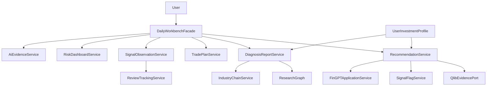

# final_plan.md 重构计划

## 重构目标

将平台从“很多专业工具”收敛为“散户每天打开的 AI 炒股助手”：每天给出可解释推荐、诊股结论、买卖计划、风险提醒、复盘反馈与陪伴式投顾。

当前已具备一部分 MVP：`DailyWorkbenchService`、`WatchlistAgentService`、`TradePlanService`、`SignalObservationService`、`AiEvidenceService`。下一步不应继续在这些服务里堆逻辑，而要抽出更稳定的产品边界。

## 目标架构

## 第一阶段：每日 AI 推荐 Top3

建立独立 `RecommendationService`，输出固定契约：每日 3-5 只候选、推荐理由、产业链位置、买入区间、止损/止盈、预期盈亏比、历史类似信号胜率。

落点：
- 新增 `app/application/services/recommendation_service.py`
- 新增 `app/presentation/api/routes_v1_recommendations.py`
- 扩展 `app/presentation/web/templates/daily_workbench.html`
- 复用 `app/application/services/selection_source_service.py`、`signal_flag_service.py`、`trade_plan_service.py`、`ai_evidence_service.py`

关键原则：推荐服务只编排，不直接写底层数据；历史胜率先用 `SignalObservationService` 与回测结果估算，后续再接 Qlib 类似信号回测。

## 第二阶段：AI 诊股报告标准化

把当前 AI 分析、多智能体研究、证据链收敛为“诊股报告”制品，输出固定章节：一句话结论、产业链、基本面、技术面、资金/情绪、风险点、操作计划、证据链。

落点：
- 新增 `DiagnosisReportService`
- 复用 `app/application/services/ai_analysis_service.py`
- 复用 `app/application/services/ai_research_service.py`
- 复用 `app/agents/research/graph.py`
- 结果可落到现有 `analysis_report_repository`

避免让 `ai_analysis_service.py` 继续承担“轻分析 + 深报告 + 证据链 + 持久化”的混合职责。

## 第三阶段：产业链智能梳理

新增独立 `IndustryChainService`，为个股和行业生成上中下游结构、核心驱动、当前机会点与风险点。MVP 先返回结构化 JSON 和 Mermaid/节点列表，后续再做图形化页面。

落点：
- `app/application/services/industry_chain_service.py`
- `app/presentation/api/routes_v1_industry_chain.py`
- 个股详情页和诊股报告页新增产业链区块

数据来源先复用新闻、研报、基本面、行业字段；不要一开始就引入复杂图数据库。

## 第四阶段：复盘与胜率追踪

在 `SignalObservationService` 之上新增 `ReviewTrackingService`，聚合每日/每周操作：推荐命中、观察单收益、止盈止损触发、平均盈亏比、用户反馈。

落点：
- 新增 `ReviewTrackingService`
- 新增 `/api/v1/reviews/daily`、`/api/v1/reviews/weekly`
- 新增页面或操盘台区块“本周复盘”

先统计模拟观察单，后续再接真实持仓或交易账户。

## 第五阶段：个人投资经理与用户偏好

新增 `UserInvestmentProfileService`，记录用户风险偏好、持仓风格、关注行业、短线/中线/价值偏好。投资经理 Agent 读取该 Profile，再生成个性化建议。

落点：
- 新增用户投资画像服务与轻量存储
- 扩展 `investment_manager_service.py` 的对话入口，但不要把用户记忆塞进投资经理表
- 未来接 LangGraph checkpoint 或 Memory 服务

## 第六阶段：知识库、社交与组合风险

中优先级增强：
- 财经知识库：用 `ResearchReportRAGService` 和现有知识存储封装成散户问答入口。
- 朋友圈增强：AI 生成热点摘要和一键分享诊股报告，带免责声明和水印。
- 组合风险仪表盘：组合暴露、压力测试、行业集中度、单票风险和止损提醒统一在一个页面。

## 验收标准

每个阶段都要满足：
- 有稳定 API 契约，前端只消费应用服务输出。
- 输出包含 `evidence`、`confidence` 或等价可信字段。
- 涉及行为、数据格式、接口或页面入口的改动，更新 `REFACTORING_LOG.md`。
- 新增服务接入 `bootstrap_components/services.py` 与 `ApiV1Context`。
- 对关键服务做最小编译/路由级验证。

## 优先执行建议

先做第一阶段 `RecommendationService`，因为它直接对应 `final_plan.md` 最高优先级“每日 AI 推荐 Top3”，也最能提升每日打开率。现有操盘台、信号旗、买卖计划、观察单、证据链都已经具备可复用基础。