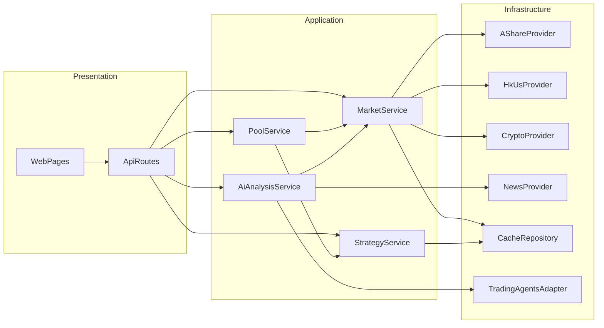

# 量化平台全量重构执行方案

## 目标边界
- 第一主线：将 `scripts` 能力各归其位迁入 `app`，最终运行时不依赖 `scripts`。
- 第二主线：交付 A/HK/US/Crypto 全景、实时行情、历史落盘、盘中动态股票池。
- 第三主线：新增 AI 分析页面，接入本地大模型并复用 TradingAgents-CN 的研究流程（适配器模式）。

## 交付阶段

### 阶段A：去 scripts 运行时依赖（先稳住现有A股）
- 迁移遗留连接器与拉取器：将 `scripts/tdx_*`、`realtime_reader` 相关能力迁到 `app/infrastructure/adapters` 与 `app/infrastructure/providers`。
- 迁移页面模板：将 `scripts/templates/*` 迁至 `app/presentation/web/templates`，并更新 [app/config.py](e:/project/workspace/python/quant-atlas/app/config.py) 中模板目录。
- 清理 legacy 入口：删除/归档仅迁移参考脚本，保留迁移映射文档。
- 验收：`app` 全链路运行时不再 import `scripts`，核心 API 与页面保持可用。

### 阶段B：多市场全景与实时/历史闭环
- 新增统一市场提供器分层：
  - `A股`: 现有 provider 保留并增强。
  - `港美`: 新增 yfinance provider（现货快照 + 历史K线）。
  - `加密`: 新增 Binance provider（REST + WebSocket 推流）。
- 增加市场聚合服务：在 `app/application/services/market_service.py` 增加 `CN/HK/US/CRYPTO` 聚合全景方法。
- 历史数据落盘：统一写入 [app/infrastructure/database/stock_cache_db.py](e:/project/workspace/python/quant-atlas/app/infrastructure/database/stock_cache_db.py)，补齐按市场/标的分区键。
- 验收：`/api/v1/markets/<market>/panorama|quotes` 支持四市场；断网时可回退最近缓存快照。

### 阶段C：盘中动态股票池与策略联动
- 新增盘中池服务 `pool_service`：
  - 输入：实时行情流 + 历史指标 + 市场情绪。
  - 输出：候选池（新入池/增强/移除状态）。
- 将 `StrategyApplicationService` 与市场状态路由打通：根据市场 regime 自动切换策略组。
- 增加盘中任务编排：扫描器分市场调度，池更新周期独立于全市场刷新周期。
- 验收：提供 `pool` API 与页面可视化，盘中可实时看到股票池变化与触发原因。

### 阶段D：个股详情增强（行业新闻 + 实时）
- 新闻能力扩展：在 `app/infrastructure/providers/news.py` 增加“个股新闻 + 行业新闻”聚合接口。
- 详情页改造：`stock detail` 同屏展示实时行情、技术指标、个股新闻、行业新闻、策略结论。
- 缓存策略：新闻与行情分层缓存（短TTL实时层 + 长TTL历史层）。
- 验收：详情页接口返回结构稳定且具备实时刷新能力。

### 阶段E：AI 分析页面（TradingAgents 适配器模式）
- 新增 AI 适配层：`app/infrastructure/adapters/tradingagents_adapter.py`，封装对 `E:/project/workspace/python/TradingAgents-CN-lastest` 的调用。
- 新增 AI 服务：`app/application/services/ai_analysis_service.py`，统一输入（标的/市场/时间窗）与输出（观点/风险/建议）。
- 新增页面与API：
  - 页面：`/ai-analysis`
  - API：`/api/v1/ai/analyze`、`/api/v1/ai/report`
- 模型接入：默认本地 Ollama（可配置模型名与超时），失败返回可解释错误。
- 验收：可对个股生成完整 AI 分析报告，并可引用行情/新闻/策略上下文。

## 架构与数据流（目标态）

## 关键文件落点
- 配置与启动：
  - [app/config.py](e:/project/workspace/python/quant-atlas/app/config.py)
  - [app/bootstrap.py](e:/project/workspace/python/quant-atlas/app/bootstrap.py)
- 多市场 provider：
  - [app/infrastructure/providers/market_data.py](e:/project/workspace/python/quant-atlas/app/infrastructure/providers/market_data.py)
  - 新增 `hkus_market_data.py`、`crypto_market_data.py`
- 新闻扩展：
  - [app/infrastructure/providers/news.py](e:/project/workspace/python/quant-atlas/app/infrastructure/providers/news.py)
- 应用服务：
  - [app/application/services/market_service.py](e:/project/workspace/python/quant-atlas/app/application/services/market_service.py)
  - [app/application/services/strategy_service.py](e:/project/workspace/python/quant-atlas/app/application/services/strategy_service.py)
  - 新增 `pool_service.py`、`ai_analysis_service.py`
- API与页面：
  - [app/presentation/api/routes.py](e:/project/workspace/python/quant-atlas/app/presentation/api/routes.py)
  - [app/presentation/web/pages.py](e:/project/workspace/python/quant-atlas/app/presentation/web/pages.py)
- 缓存与迁移：
  - [app/infrastructure/database/stock_cache_db.py](e:/project/workspace/python/quant-atlas/app/infrastructure/database/stock_cache_db.py)

## 风险与控制
- 多源实时数据不稳定：增加分级回退链（实时源 -> 备用源 -> 本地缓存）。
- scripts 拆除导致能力丢失：迁移采用“模块对齐 + 契约测试”并保持灰度开关。
- AI 推理延迟：任务异步化（排队 + 超时 + 结果缓存），前端轮询报告状态。
- 前端兼容风险：保持 `ENABLE_API_LEGACY_RESPONSE_FIELDS` 开关直到前端切换完成。