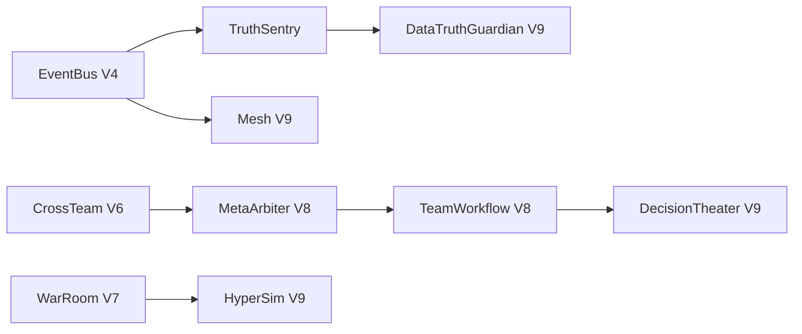

# Quant Atlas Option 1–9：演进纪要与集成验收（收口版）

> **文档角色**：产品演进（Option 规划）与工程验收（V1–V9）的**唯一收口文档**  
> **验收基线**：2026-06-06 · `REFACTORING_LOG.md`  
> **自动化**：`tests/integration/test_v1_v9_acceptance_smoke.py` + V4–V9 专项用例

---

## 0. 阅读指引

| 章节 | 内容 |
|------|------|
| §1 | Option 规划阶段 ↔ 产品版本 **对照表**（纠正历史文档中的版本混用） |
| §2 | 分阶段 **交付锚点 + 验收状态** 矩阵 |
| §3 | **自动化 / 人工** 集成验收命令与清单 |
| §4 | 已知缺口 |
| §5 | 验收结论 |
| 附录 A | 历史规划纪要（压缩） |
| 附录 B | V4–V9 API 速查 |

> 原独立文件 `QUANT_ATLAS_V1_V9_集成验收.md` 已合并至本文档，仅保留跳转说明。

---

## 1. 版本对照（重要）

早期规划文档中的 **「Option 8.0 分布式智能集群」** 与产品代号 **「Quant Atlas 8.0 协作脑」** 不是同一版本：

| 产品版本 | 主题 | 对应 Option 规划 | 说明 |
|----------|------|------------------|------|
| **V1** | 数据基石 | Foundation | TDX / AkShare / yfinance、K 线、基础数据 |
| **V2** | 策略回测 | Foundation | 40+ 策略、`StrategyApplicationService` |
| **V3** | 智能研究 | Foundation + **Option 3.0** | LangGraph Agent、`ToolFacade`、ServiceRegistry |
| **V4** | 感知内核 | **Option 4.0** | EventBus、TruthSentry、辩论仲裁、行为拓扑 |
| **V5** | 因果闭环 | **Option 5.0** | SequenceChain、CorrectionIntent、Jarvis 主动、影子接管 |
| **V6** | 协作 OS | **Option 6.0** | 多租户、团队黑板、跨团队元学习 |
| **V7** | 感知投研 | **Option 7.0** | Swarm 编排、叙事、War Room、语音、Jarvis 语义 |
| **V8** | 协作脑 | **Option 7.0 展望**（元仲裁/流水线/沉浸回溯） | MetaArbiter、Team Workflow、Decision Replay |
| **V9** | 分布式集群 | **Option 8.0 蓝图**（原稿所称 8.0 Mesh） | Mesh、无界执行、Hyper-Sim、真值守卫、决策剧场 |

**纠正**：原稿末尾称「7.0 仍处于设计阶段」已过时——**V7/V8/V9 核心代码与测试均已落地**（见 §2、`REFACTORING_LOG.md`）。

### 1.1 实测完成度快照（2026-06-06）

| 主题 | 产品代号 | 后端 | UI / 协议 | 实测锚点 |
|------|----------|------|-----------|----------|
| **感知投研生态** | **V7** | **~90%** | Swarm 拖拽编辑器待与 `research_graph_topology.json` 双向保存 | `TopologyLoader` + `graph.py` 图驱动；`NarrativeSynthesisService` + `SequenceChain` |
| **协作脑** | **V8** | **~85%** | Decision Replay 3D 待预发人工 | `MetaArbiter`、`TeamWorkflow`、`DecisionReplaySpace` |
| **分布式智能集群** | **V9**（原稿 Option 8.0） | **~80%** | 跨节点 Agent 发现已起步 | `borderless_router`、`MeshNodeRegistry`、`AgentDiscoveryProtocol` |

**V7 细化**

| 能力 | 状态 | 证据 |
|------|------|------|
| 可视化编排（图驱动） | ✅ 后端 | `research_graph_topology.json` → `TopologyLoader` → `graph.py` 动态连边 |
| Swarm Designer UI | 🟡 ~70% | `/swarm-designer` 拖拽重排 + 预设 `research_default`；缺拓扑写回 JSON |
| 生成式叙事 | 🟡 数据就绪 | `AiEvidenceService.build_bundle`（行情/FinGPT/信任分/反事实）；`NarrativeSynthesisService` 已接 SequenceChain |
| 证据包 → 日报全链路 | 🟡 | `SmartDailyBriefingService` 具备叙事字段；`AiEvidenceService` 未统一注入叙事层 |

**V9 细化（用户所称「8.0 分布式」）**

| 能力 | 状态 | 证据 |
|------|------|------|
| 无界执行路由 | ✅ | `borderless_router` 符号推断 → `paper_*` / `redis_*` / QMT 槽位 |
| 多市场槽位 | ✅ | CN / US / HK / CRYPTO 驱动注册 |
| 分布式网格 | 🟡 | `app/core/mesh/` + Redis/NATS 传输；`app/core/patterns/` 为通用设计模式库（非 Mesh 专用） |
| 跨节点 Agent 发现 | 🟡 新增 | `AgentDiscoveryProtocol` + `GET /mesh/agents/discover` |

> **命名提醒**：本文 **V9 = 分布式集群**；**V8 = 协作脑（MetaArbiter/流水线）**。勿与早期 Option 文档的「8.0 分布式」混用。

---

## 2. 分阶段交付与验收矩阵

状态图例：**✅ 已验收（自动化）** · **🟡 已落地待人工** · **⬜ 规划/缺口**

### 2.1 Foundation（V1–V3 + 工作流/插件化）

| 规划要点 | 代码锚点 | 测试/证据 | 状态 |
|----------|----------|-----------|------|
| 多源行情与 K 线 | `infrastructure/providers/`、`BasicMarketDataService` | 平台手册 §6 | ✅ |
| 策略回测 | `BacktestCapability`、`StrategyApplicationService` | `BacktestCapability` 注册 | ✅ |
| LangGraph 研究 | `app/agents/research/` | `integrated_graph` | ✅ |
| **Workflow Spine** | `app/application/workflows/*` | `WorkflowService` 冒烟 | ✅ |
| **Plugin Capability** | `CapabilityRegistry`、`tool_facade_service` | Registry 冒烟 | ✅ |
| DTO / API v2 | `domain/dto/`、`routes_v2.py` | 按需人工抽测 | 🟡 |

### 2.2 Option 3.0（微内核 + 用户知识）

| 规划要点 | 代码锚点 | 测试/证据 | 状态 |
|----------|----------|-----------|------|
| ServiceRegistry | `app/core/registry.py` | 导入 + `@register_service` | ✅ |
| EventBus | `app/core/event_bus.py` | `test_v1_v9_acceptance_smoke` | ✅ |
| UserKnowledgeService | `user_knowledge_service.py` | `test_behavior_topology*` | ✅ |
| 证据图谱 / Command Plan | `routes_v1_system.py`、`CommandPlanService` | 人工 `/command/plan` | 🟡 |

### 2.3 Option 4.0（感知内核）

| 规划要点 | 代码锚点 | 测试/证据 | 状态 |
|----------|----------|-----------|------|
| UnifiedDataTruth | `infrastructure/data_truth/` | TruthSentry 联动 | ✅ |
| TruthSentry | `infrastructure/realtime/truth_sentry.py` | `test_data_truth_guardian_*` | ✅ |
| DebateArbiter / SwarmArbiter | `debate_bus.py`、`DebateArbiterService` | `test_debate_arbiter_*` | ✅ |
| 行为拓扑 | `behavior_topology.py` | `test_behavior_topology_guardian` | ✅ |
| SystemPulse | `SystemPulseService` | 冒烟导入 | ✅ |

### 2.4 Option 5.0（因果副驾驶）

| 规划要点 | 代码锚点 | 测试/证据 | 状态 |
|----------|----------|-----------|------|
| SequenceChain | `sequence_chain_service.py` | `test_sequence_chain_team_scope` | ✅ |
| CorrectionIntent | `correction_intent_service.py` | 接线 + API | ✅ |
| Jarvis Proactive | `jarvis_proactive_service.py` | `test_jarvis_proactive` | ✅ |
| 影子接管 / CoPilot | `strategy_copilot_service.py` | `test_strategy_copilot_service` | ✅ |
| SmartDegradeGateway | `smart_degrade_gateway.py` | `GET /system/stream-topology` | 🟡 |

### 2.5 Option 6.0（协作 OS）

| 规划要点 | 代码锚点 | 测试/证据 | 状态 |
|----------|----------|-----------|------|
| Tenant / Team ORM | `models/collaboration.py` | `test_user_lifecycle_sql` | ✅ |
| CollaborationService | `user/collaboration_service.py` | `test_collaboration_service` | ✅ |
| TeamBlackboard | `team_blackboard_service.py` | `test_team_blackboard_service` | ✅ |
| CrossTeamMetaLearning | `cross_team_meta_learning_service.py` | `test_cross_team_meta_learning_*` | ✅ |
| Headless 组件化 | `partials/*.html` | UI 人工 | 🟡 |

### 2.6 Option 7.0（感知投研 — 产品 V7）

| 规划要点 | 代码锚点 | 测试/证据 | 状态 |
|----------|----------|-----------|------|
| TopologyLoader 图驱动 | `research_graph_topology.json`、`graph.py` | `test_topology_loader` | ✅ |
| Swarm Flow Editor (React Flow) | `swarm_designer_flow.html`、`PUT /swarm/topology/research-graph` | 人工 `/swarm-designer/flow` | 🟡 |
| Narrative 2.0 因果研报 | `synthesize_causal_report`、`GET /briefing/causal-report` | `test_causal_report_*` | 🟡 |
| 生成式叙事（日报） | `NarrativeSynthesisService` + `SequenceChain` | `test_narrative_synthesis_*` | 🟡 |
| War Room | `SimulationGatewayService` | `test_simulation_gateway_*` | ✅ |
| 语音简报 | `VoiceBriefingService` | `test_voice_briefing_*` | ✅ |
| Jarvis 语义 | `JarvisSemanticRouterService` | `test_jarvis_semantic_router` | 🟡 |

### 2.7 协作脑（产品 V8）

| 规划要点 | 代码锚点 | 测试/证据 | 状态 |
|----------|----------|-----------|------|
| MetaArbiter | `meta_arbiter_service.py` | `test_meta_arbiter_*` | ✅ |
| Team Workflow 2.0 | `team_workflow_service.py` | `test_team_workflow_*` | ✅ |
| Decision Replay 3D | `decision_replay_space_service.py` | `test_decision_replay_*` | ✅ |

### 2.8 分布式集群（原 Option 8.0 蓝图 — 产品 V9）

| 规划要点 | 代码锚点 | 测试/证据 | 状态 |
|----------|----------|-----------|------|
| Federated Mesh | `app/core/mesh/` | `test_distributed_event_bus` | ✅ |
| Agent 发现协议 | `agent_discovery.py` | `test_mesh_agent_discovery` | 🟡 |
| Borderless Execution | `borderless_execution_service.py` | `test_borderless_execution_*` | ✅ |
| Hyper-Simulator | `hyper_simulator_service.py` | `test_hyper_simulator_*` | ✅ |
| Data Truth Guardian | `data_truth_guardian_service.py` | `test_data_truth_guardian_*` | ✅ |
| Decision Theater | `decision_theater_service.py` + `research_pipeline.html` | `test_decision_theater_*` | 🟡 UI |

---

## 3. 集成验收

### 3.1 架构关系（V4–V9）



**Bootstrap 末段接线**（`wire_optional_application_services`）：

```
meta_arbiter → swarm_topology → team_workflow → simulation_gateway
→ voice_briefing → jarvis_semantic → decision_replay
→ mesh_gateway → borderless_execution → hyper_simulator
→ data_truth_guardian → decision_theater
```

### 3.2 自动化验收（一键）

```powershell
Set-Location e:\project\workspace\myrepo\quant-atlas

# Option 1–9 冒烟（Foundation + V4–V9）
python -m pytest tests/integration/test_v1_v9_acceptance_smoke.py -q

# V4–V9 专项回归
python -m pytest tests/core/test_distributed_event_bus.py `
  tests/application/test_meta_arbiter_service.py `
  tests/application/test_team_workflow_service.py `
  tests/application/test_decision_replay_space_service.py `
  tests/application/test_simulation_gateway_service.py `
  tests/application/test_narrative_synthesis_service.py `
  tests/application/test_borderless_execution_service.py `
  tests/application/test_hyper_simulator_service.py `
  tests/application/test_data_truth_guardian_service.py `
  tests/application/test_decision_theater_service.py `
  tests/application/test_cross_team_meta_learning_service.py -q
```

**期望**：冒烟 **12 passed**（Foundation 3 + V4–V9 9）+ 专项 **≥28 passed**（2026-06-06 实测通过）。

### 3.3 人工验收清单

| # | 场景 | 页面 / API | 版本 |
|---|------|------------|------|
| 1 | 决策简报 / 共振 / 归因 | 个股详情 | V4 |
| 2 | 影子策略 handover | `/strategy/copilot` | V5 |
| 3 | 团队协作 | `/collaboration` | V6 |
| 4 | 团队流水线 | `/collaboration` Workflow 面板 | V8 |
| 5 | Swarm 编排 | `/swarm-designer` | V7 |
| 6 | War Room | `/war-room` | V7 |
| 7 | 语音简报 | `/voice-briefing` | V7 |
| 8 | 决策回溯 3D | `/decision-replay` | V8 |
| 9 | 决策剧场 | `/research-pipeline` Three.js | V9 |
| 10 | 真值扫描 | `POST /api/v1/data-truth/scan` | V9 |
| 11 | Mesh 联邦 | `MESH_ENABLED=true` 重启日志 | V9 |

### 3.4 环境变量（V4–V9）

| 变量 | 默认 | 说明 |
|------|------|------|
| `MESH_ENABLED` | `0` | V9 联邦 Mesh |
| `MESH_NODE_ID` / `MESH_REGION` | `cn-gateway-1` / `CN` | 节点身份 |
| `BORDERLESS_EXECUTION_ENABLED` | `true` | V9 无界执行 |
| `EXECUTION_DEFAULT_MODE` | `paper` | `paper` / `redis` / `qmt` |
| `EXECUTION_REDIS_URL` | `TASK_MESSAGE_REDIS_URL` | Redis Stream 执行队列 |
| `EXECUTION_REDIS_FALLBACK_PAPER` | `true` | Redis/worker 不可用时回退纸面成交 |
| `EXECUTION_REGISTER_REDIS_DRIVERS` | `true` | 注册 `redis_cn/us/hk/crypto` 驱动 |
| `DATA_TRUTH_GUARDIAN_ENABLED` | `true` | V9 真值守卫 |
| `DATA_TRUTH_QUORUM_ENABLED` | `true` | 三源拜占庭法定多数扫描 |
| `MESH_TRANSPORT` | `redis` | `redis` / `nats` / `memory`（V9 Mesh 传输） |
| `MESH_NATS_URL` | `nats://127.0.0.1:4222` | NATS 模式时必填（需 `nats-py`） |
| `ENABLE_QLIB` / `ENABLE_RD_AGENT` | settings | 研究管线 |
| `OPENAI_API_KEY` | — | V7 TTS（可选） |

---

## 4. 已知缺口

| 缺口 | 影响 | 优先级 |
|------|------|--------|
| Cross-Node EventBus 统一门面（`ClusterEventBusFacade`） | ✅ 已落地；NATS 规模化部署仍为 P3 | — |
| 前端 Headless / 全站 React 微前端 | V6–V7 UI 愿景 | P2 |
| 全球多市场执行实盘（Alpaca/Binance API 非模拟） | V8–V9 无界执行 | P2 |
| QuestDB/CH 流式实时拜占庭共识 | V9 真值守卫（日 K 三源法定多数已落地） | P3 |
| NATS Mesh 需独立部署 `nats-py` | V9 规模化（已支持 `MESH_TRANSPORT=nats`） | P3 |
| V1–V3 无独立 REFACTORING 小节 | 文档追溯 | P3 |

**2026-06-06 已补齐（7.0→8.0 重心）**

| 能力 | 状态 |
|------|------|
| `NarrativeSynthesisService` ← `SequenceChain` 证据驱动 | ✅ |
| Swarm Designer HTML5 拖拽重排 + `agent-topology` 权重联动 | ✅ |
| Mesh `NATSMeshTransport` + `MESH_TRANSPORT` | ✅ |
| Borderless `redis_*` 多市场驱动 + Crypto 路由修复 | ✅ |
| Data Truth 拜占庭法定多数（TDX/Qlib/AkShare）+ Mesh 多节点验收 | ✅ |
| Research `TopologyLoader` JSON 拓扑 + 团队黑板 Socket.IO 推送 | ✅ |
| `ClusterEventBusFacade` + `GET /system/event-bus/cluster` | ✅ |
| React Flow 拓扑编辑器 + `instance/research_topology` 覆盖保存 | ✅ |
| Narrative 2.0 `synthesize_causal_report` 长篇因果研报 | ✅ |
| `TradingBotService` → `ExecutionGateway` 驱动抽象 | ✅ |

---

## 5. 验收结论

| 项 | 结果 | 备注 |
|----|------|------|
| Option 对照与文档收口 | ☑ **完成** | 本文档 §1 纠正版本混用 |
| 自动化 pytest | ☑ **通过** | 2026-06-06：冒烟 12 + 专项 28 = **40 passed** |
| 分阶段矩阵 §2 | ☑ **已填** | 标注 ✅ / 🟡 |
| API / UI 人工 §3.3 | ☐ **待预发** | 需登录 Session |
| `REFACTORING_LOG` 同步 | ☑ **完成** | 见对应日期条目 |

---

## 附录 A：历史规划纪要（压缩）

1. **Foundation**：资源中心 → 任务/工作流中心；Workflow Hub + Capability 插件 + DTO。  
2. **Option 3.0**：ServiceRegistry、EventBus、UserKnowledge、证据图谱、Jarvis 复合指令。  
3. **Option 4.0**：Arbiter 辩论、TruthSentry、行为拓扑、组件化 UI。  
4. **Option 5.0**：SequenceChain 血缘、CorrectionIntent、影子接管、Live-Document、Jarvis 主动。  
5. **Option 6.0**：多租户、团队黑板、跨团队元学习、社交投研流。  
6. **Option 7.0**：Swarm Designer、生成式叙事、War Room、语音与语义穿透。  
7. **Option 7.0 展望 → 产品 V8**：元仲裁、投研流水线 2.0、沉浸决策回溯。  
8. **Option 8.0 蓝图 → 产品 V9**：Mesh、真值守卫、Hyper-Sim、无界执行、决策剧场。

详细变更路径见 [`REFACTORING_LOG.md`](../REFACTORING_LOG.md)（2026-06-06 批次）。

---

## 附录 B：V4–V9 API 速查

| 版本 | 代表端点 |
|------|----------|
| V4–V5 | `/system/arbiter/*`、`/system/sequence-chain`、`/jarvis/proactive` |
| V6 | `/teams/*`、跨团队告警 |
| V7 | `/swarm/topology/*`、`/briefing/smart-daily`、`/simulation/war-room/*`、`/briefing/voice-daily` |
| V8 | `/system/meta-arbiter/*`、`/teams/{id}/workflows/*`、`/decision-replay/space` |
| V7 | `/swarm/topology/research-graph`、`/briefing/smart-daily` |
| V9 | `/mesh/*`（含 `/agents/discover`）、`/execution/*`、`/simulation/hyper/*`、`/data-truth/*`（含 `/quorum`）、`/decision-theater/space` |

---

## 相关文档

| 文档 | 用途 |
|------|------|
| [QUANT_ATLAS_平台手册.md](./QUANT_ATLAS_平台手册.md) | 部署与功能总览 |
| [REFACTORING_LOG.md](../REFACTORING_LOG.md) | 逐条代码变更审计 |
| [app/README.md](../app/README.md) | 分层架构 |

*收口版维护原则：规划叙述以附录 A 为准；验收事实以 §2–§5 与 pytest 为准。*
